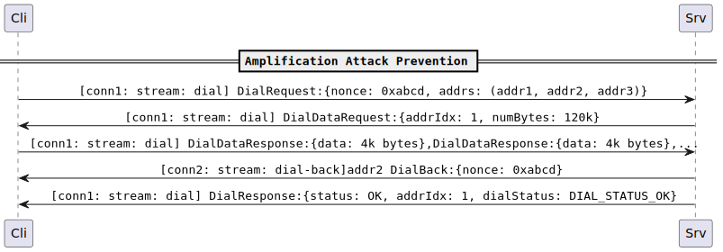

# AutonatV2: spec


| Lifecycle Stage | Maturity                 | Status | Latest Revision |
|-----------------|--------------------------|--------|-----------------|
| 1A              | Working Draft            | Active | r2, 2023-04-15  |

Authors: [@sukunrt]

Interest Group: [@marten-seemann], [@marcopolo], [@mxinden]

[@sukunrt]: https://github.com/sukunrt
[@marten-seemann]: https://github.com/marten-seemann
[@mxinden]: https://github.com/mxinden
[@marcopolo]: https://github.com/marcopolo


## Overview

A priori, a node cannot know if it is behind a NAT / firewall or if it is
publicly reachable. Knowing its NAT status is essential for the node to be
well-behaved in the network: A node that's behind a NAT / firewall doesn't need
to advertise its (undialable) addresses to the rest of the network, preventing
superfluous dials from other peers. Furthermore, it might actively seek to
improve its connectivity by finding a relay server, which would allow other
peers to establish a relayed connection.

In `autonat v2` client sends a request with a priority ordered list of addresses
and a nonce. On receiving this request the server dials the first address in the
list that it is capable of dialing and provides the nonce. Upon completion of
the dial, the server responds to the client with the response containing the
dial outcome.

As the server dials _exactly_ one address from the list, `autonat v2` allows
nodes to determine reachability for individual addresses. Using `autonat v2`
nodes can build an address pipeline where they can test individual addresses
discovered by different sources like identify, upnp mappings, circuit addresses
etc for reachability. Having a priority ordered list of addresses provides the
ability to verify low priority addresses. Implementations can generate low
priority address guesses and add them to requests for high priority addresses as
a nice to have. This is especially helpful when introducing a new transport.
Initially, such a transport will not be widely supported in the network.
Requests for verifying such addresses can be reused to get information about
other addresses

The client can verify that the server did successfully dial an address of the
same transport as it reported in the response by checking the local address of
the connection on which the nonce was received on.  

Compared to `autonat v1` there are three major differences
1. `autonat v1` allowed testing reachability for the node. `autonat v2` allows
testing reachability for an individual address.
2. `autonat v2` provides a mechanism for nodes to verify whether the peer
actually successfully dialled an address.
3. `autonat v2` provides a mechanism for nodes to dial an IP address different
from the requesting node's observed IP address without risking amplification
attacks. `autonat v1` disallowed such dials to prevent amplification attacks.


## AutoNAT V2 Protocol


A node wishing to determine reachability of its adddresses sends a `DialRequest`
message to a peer on a stream with protocol ID `/libp2p/autonat/2/dial`. Each
`DialRequest` is sent on a new stream.

This `DialRequest` message has a list of addresses and a fixed64 `nonce`. The
list is ordered in descending order of priority for verification. 

Upon receiving this request, the peer selects the first address from the list of
addresses that it is capable of dialing. The peer MUST NOT dial any address
other than this one. If this selected address has an IP address different from
the requesting node's observed IP address, peer initiates the Amplification
attack prevention mechanism (see [Amplification Attack
Prevention](#amplification-attack-prevention) ). On completion, the peer
proceeds to the next step. If the selected address has the same IP address as
the requesting node's observed IP address, peer proceeds to the next step
skipping Amplification Attack prevention steps.

The peer dials the selected address, opens a stream with Protocol ID
`/libp2p/autonat/2/attempt` and sends a `DialAttempt` message with the nonce
received in the request. The peer MUST close this stream after sending the
`DialAttempt` message.

Upon completion of the dial attempt, the peer sends a `DialResponse` message to
the initiator node on the `/libp2p/autonat/2/dial` stream. This response
contains a list of `DialStatus`es with a status for each address in the list up
to and including the address that the peer attempted to dial. The `DialStatus`
for an address is set according to [Requirements for
DialStatus](#requirements-for-dialstatus). The response also contains an
appropriate `ResponseStatus` set according to [Requirements For
ResponseStatus](#requirements-for-responsestatus).

The initiator MUST check that the nonce received in the `DialAttempt` is the
same as the nonce the it sent in the `DialRequest`. If the nonce is different,
it MUST discard this response.

The peer MUST close the stream after sending the response. The initiator MUST
close the stream after receiving the response.


### Requirements for DialStatus

On receiving a `DialRequest` the peer goes through the list of addresses in the
request to select the first address that it is capable of dialing. For every
address that the peer checks, it assigns a `DialStatus` according to the
following requirements. 

For addresses that the peer decides to not dial:

`E_ADDRESS_UNKNOWN`: The peer didn't understand the address. 

`E_TRANSPORT_NOT_SUPPORTED`: The peer understood the address, but has no
transport capable of dialing the requested address. 

`E_DIAL_REFUSED`: The peer didn't dial the address because of address
based restrictions like address based rate limit, the address being a private IP
address, or a relay address.

For the address that the peer decided to dial:

`E_DIAL_ERROR`: The peer was unable to connect to the address

`E_CONN_UPGRADE_FAILED`: The peer was able to connect to the other address, but
failed to complete the connection upgrade step. 

`E_ATTEMPT_ERROR`: The peer was able to establish an upgraded connection but
some error occured when sending the nonce on the `/libp2p/autonat/2/attempt`
stream.

`OK`: The peer successfully dialed the selected address.

The peer MUST NOT send dial statuses for addresses after the one it selected to
dial.


### Requirements for ResponseStatus

The `ResponseStatus` sent by the peer in the `DialResponse` message MUST be set
according to the following requirements

`OK`: the peer completed the request successfully. A request is considered
completed successfully when the peer either completes a dial(successfully or
unsuccessfully) or rejects all addresses in the request as undialable. 

`E_BAD_REQUEST`: the peer was unable to decode the request.

`E_REQUEST_REFUSED`: the peer didn't attempt to serve the request because of
rate limiting, resource limit reached or blacklisting.

`E_INTERNAL_ERROR`: error not classified within the above error codes occured on
peer that prevented it from completing the request.

Implementations MUST discard responses with status codes they do not understand. 

### Amplification Attack Prevention




When a client asks a server to dial an address that is not the client's observed
IP address, the server asks the client to send him some non trivial amount of
bytes as a cost to dial a different IP address. To make amplification attacks
unattractive, the number of bytes is decided such that it's sufficiently larger
than a new connection handshake cost.

On receiving a `DialRequest`, the server selects the first address it is capable
of dialing. If this selected address has a IP different from the client's
observed IP, the server sends a `DialDataRequest` message with the selected
address's index(0 based) and `numBytes` set to a sufficiently large value on the
`/libp2p/autonat/2/dial` stream

Upon receiving a `DialDataRequest` message, the client decides whether to accept
or reject the cost of dial. If the client rejects the cost, the client resets
the stream and the `DialRequest` is considered aborted. If the client accepts
the cost, the client starts transferring `numBytes` bytes to the server. The
server on receiving `numBytes` bytes proceeds to dial the candidate address. 

## Implementation Suggestions

For any given address, implementations SHOULD do the following
- periodically recheck reachability status
- query multiple peers to determine reachability

The suggested heuristic for implementations is to consider an address reachable
if more than 3 peers report a successful dial and to consider an address
unreachable if more than 3 peers report unsuccessful dials. 

Implementations are free to use different heuristics than this one

## RPC Messages

All RPC messages sent over a stream are prefixed with the message length in
bytes, encoded as an unsigned variable length integer as defined by the
[multiformats unsigned-varint spec][uvarint-spec]. 

All RPC messages on stream `/libp2p/autonat/2/dial` are of type `Message`. A
`DialRequest` message is sent as a `Message` with the `msg` field set to
`DialRequest`. `DialResponse` and `DialDataRequest` are handled similarly. 

On stream `/libp2p/autonat/2/attempt`, a `DialAttempt` message is sent directly

```proto
syntax = "proto3";

message Message {
    oneof msg {
        DialRequest dialRequest   = 1;
        DialResponse dialResponse = 2;
        DialDataRequest dialDataRequest = 3;
    }
}

message DialRequest {
    repeated bytes addrs = 1;
    fixed64 nonce = 2;
}

message DialDataRequest {
    uint32 addrIdx = 1;
    uint64 numBytes = 2;
}

message DialResponse {
    enum ResponseStatus {
        OK                        = 0;
        E_BAD_REQUEST             = 100 
        E_REQUEST_REFUSED         = 101;
        E_INTERNAL_ERROR          = 300;
    }

    enum DialStatus {
        OK                        = 0;
        E_DIAL_ERROR              = 100;
        E_CONN_UPGRADE_FAILED     = 101;
        E_ATTEMPT_ERROR           = 102;
        E_DIAL_REFUSED            = 200;
        E_TRANSPORT_NOT_SUPPORTED = 300;
        E_ADDRESS_UNKNOWN         = 301;
    }

    ResponseStatus status = 1;
    repeated DialStatus dialStatuses = 2;
}

message DialAttempt {
    fixed64 nonce = 1;
}

```

[uvarint-spec]: https://github.com/multiformats/unsigned-varint

