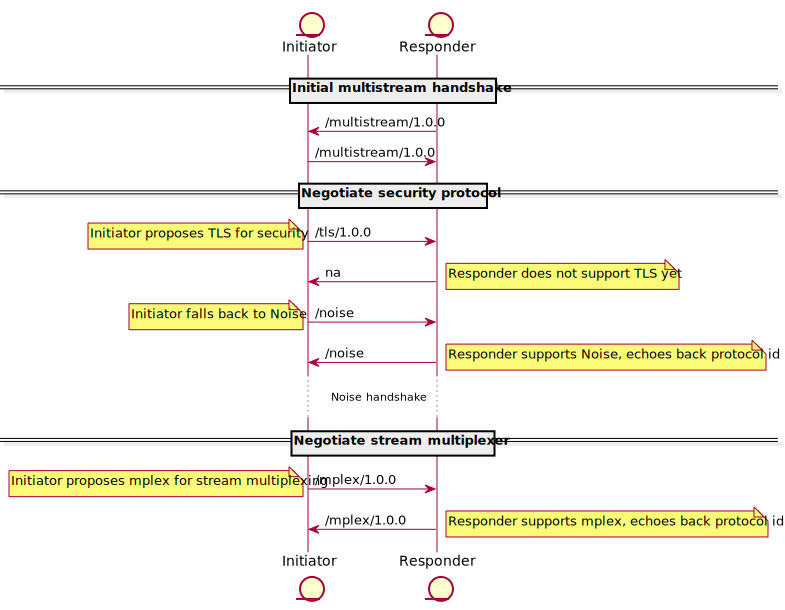

# Connection Lifecycle in libp2p

| Lifecycle Stage | Maturity      | Status | Latest Revision |
|-----------------|---------------|--------|-----------------|
| 1A              | Working Draft | Active | r0, 2019-06-20  |

Authors: [@yusefnapora], [@shadowjonathan]

Interest Group: [@JustMaier], [@vasco-santos] [@bigs], [@mgoelzer]

[@yusefnapora]: https://github.com/yusefnapora
[@shadowjonathan]: https://github.com/shadowjonathan
[@JustMaier]: https://github.com/JustMaier
[@vasco-santos]: https://github.com/vasco-santos
[@bigs]: https://github.com/bigs
[@mgoelzer]: https://github.com/mgoelzer

See the [lifecycle document][lifecycle-spec] for context about maturity level
and spec status.

[lifecycle-spec]: https://github.com/libp2p/specs/blob/master/00-framework-01-spec-lifecycle.md

## Table of Contents

- [Connection Lifecycle in libp2p](#connection-lifecycle-in-libp2p)
    - [Table of Contents](#table-of-contents)
    - [Overview](#overview)
    - [Definitions](#definitions)
    - [Connection Establishment](#connection-establishment)
        - [Core Lifecycle](#core-lifecycle)
        - [Bootstrap Protocol Negociation](#bootstrap-protocol-negociation)
        - [Advanced Concepts and Manipulation](#advanced-concepts-and-manipulation)
            - [Extended Protocol Negociation](#extended-protocol-negociation)
            - [Securing Connections](#securing-connections)
            - [Multiplexing Streams](#multiplexing-streams)
        - [Upgrading](#upgrading)
    - [Practical Considerations](#practical-considerations)
        - [State Management](#state-management)
            - [Peer Metadata Storage](#peer-metadata-storage)
            - [Connection Limits](#connection-limits)
        - [Connection Lifecycle Events](#connection-lifecycle-events)
    - [Future Work](#future-work)
    - [Miscellaneous](#miscellaneous)
        - [A Note about Interoperability](#a-note-about-interoperability)
        - [Protocol IDs (Extended)](#protocol-ids-extended)
    

## Overview

This document describes the process and anatomy of establishing connections to new peers in
libp2p, alongside describing several fundamental aiding protocols and processes. 

We also discuss the procol negociation processes that help set up sessions, and opening new additional connections over an existing connection.

This document does not cover the establishment of "transport level" connections, 
for example opening "raw" TCP sockets, as those semantics are specific to each
transport.

What is covered here is the process that occurs after making the initial
transport level connection, up to the point where "application level" connections
are opened, and their protocols are identified, and data is routed appropriately
to handler functions.

## Definitions

### Protocol

Protocols lay at the heart of libp2p, providing modularity by availability on both parties.

Protocols are abritrary processes on both ends of the libp2p [session] that write/read to the underlying [connection].

Protocols can be pretty much anything, from HTTP to Identity exchange, from [multiplexing] to security.

Protocols are identified by their **Protocol ID**. This can be any string, but convention is that protocols identify themselves by forward slashes ( `/` )

For example, `/mplex/1.0.0` is the Protocol ID for the [ `mplex` stream-multiplexing protocol][mplex].

*A recommended markup of Protocol IDs is: `/<corresponding propery>/<protocol name>/<semantic version>` , with `corresponding property` often dropped with core libp2p-backed protocols.*

An unique trait of protocols is that they're programmatically able to produce further agnostic [connections][connection] or [transports][transport], making it possible to stack features of protocols on top of eachother (see [Securing Connections](#securing-connections) and [Multiplexing Streams](#multiplexing-streams)).

### Connection

A connection is an abstract bi-directional pipe that carries a [protocol].

The connection is responsible for writing, reading, and closing the connection for the protocol. The connection is agnostic to the underlying carrier, thus, the connection acts as a read/write/closer interface for that carrier.

### Transport

The exact definition of a Transport is twofold:

In the general context of modular libp2p systems, a transport refers to the myriad of underlying carriers that libp2p can support, amongst them are TCP, UDP, Bluetooth for example. Note that this is not limited to internet transports, but that also more "high-level" carriers like QUIC and Websockets are deemed transports. Even "pseudo-transports" can exist in the form of the [ `relay` protocol][relay].

In the context of libp2p sessions, a Transport is deemed the "root" of the [session], acting as the final pipeline a byte has to travel through before responsibility is handed over to other processes, protocols, or kernel threads.

### Session

A libp2p session is an arbitrarily-defined concept, but generally it refers to the state of all corresponding protocols and connections established over the course (possibly) an [upgrading](#upgrading) process.

A session could refer to the entirety of protocols, connections, and transport(s) that connect to another peer, from the local peer, a session exists as long as one peer can still communicate with another peer (ommitting disruptions and possible attempts at recovery helped by a [protocol] or smart [transport].)

### Receiver/Initiator

These definitions are purely for simplicity, but a **Receiver** refers to the peer that receives a connection request (through a transport) from an **Initiator**, which initiated the connection.

### Multiplexing

A somewhat more abstract definition, Multiplexing is the act of splitting one connection into multiple connections, called **Streams** (though which still act as connections on their own)

A multiplexer is generally a [protocol], though it is possible that an equipped [transport] itself can produce more than one connection upon request.

[protocol]: #protocol
[connection]: #connection
[transport]: #transport
[session]: #session
[multiplexing]: #multiplexing

## Connection Establishment

### Core Lifecycle

The core functionality of libp2p lays at stacking multiple protocols on top of eachother to provide a [session] with enough security and connections to adiquitely provide services to the application level of the stack.

It starts with dialing **[transports][transport]**, the Initiator opens a transport to another peer, once the Receiver picks up, the connection is established, and the connection can be [bootstrapped](#bootstrap-protocol-negociation).

Once a suitable [Protocol Negociation protocol](#extended-protocol-negociation) is found, the process can move further with an arbitrary number of steps, going through the [upgrading](#upgrading) process, adding security protocols, adding multiplexing protocols, identifying peers, etc.

The established session exists till one of the following 2 conditions occur:

* One side closes the transport gracefully.

* The transport resets, ending the session without the possibility for graceful shutdown.

### Bootstrap Protocol Negociation

At its core, libp2p provides a way to have protocols operate abstractly over ambigious transports, and provides control over the majority of the process.

However, after opening a transport, 2 libp2p peers need to standardize selection of this myriad of protocols, to provide a "bootstrap" where other selection protocols (or simply application protocols) can take advantage from the newly agreed-upon state of the connection, and take it further.

Roughly, the state machine of this initial stage is this:

``` 
if this_node == initiator:
    send null-terminated Protocol ID string
    
    wait for same string echoed back:
        if malformed (sent-string != recv-string): close connection

        if echoed (sent-string == recv-string):
            proceed, further traffic is now protocol-specific

elif this_node == receiver:
    wait for protocol string

    when null-terminator received; 
        query corresponding protocol from received string

    when corresponding protocol is not found:
        close connection
    else:
        repeat protocol string with null-terminator
        proceed, further traffic is now protocol-specific
```

This allows libp2p to act as a reliably springboard for further protocol negociation.

*Backwards Compatibility Note: The previous specification locked the Bootstrap Protocol Negociation process into only recognising [multistream-select], `/multistream/1.0.0` , due to this lock-in, Receivers would echo that Protocol ID String to Initiators regardless if Initiators had already sent a null-terminated Protocol ID String*

### Advanced Concepts and Manipulation

#### Extended Protocol Negociation

One of libp2p's core design goals is to be adaptable to many network
environments, including those that don't yet exist. To provide this flexibility, 
the connection upgrade process supports multiple protocols for connection
security and stream multiplexing and allows peers to select which to use for
each connection.

libp2p uses a protocol called multistream-select for extended protocol negotiation. Below
we cover the basics of multistream-select and its use in libp2p. For more
details, see [the multistream-select repository][mss].

Messages are sent encoded as UTF-8 byte strings, and they are always followed by
a `\n` newline character. Each message is also prefixed with its length in bytes
(including the newline), encoded as an unsigned variable-length integer
according to the rules of the [multiformats unsigned varint spec][uvarint].

For example, the string `"na"` is sent as the following bytes (shown here in
hex):

``` 
0x036e610a
```

The first byte is the varint-encoded length ( `0x03` ), followed by `na` ( `0x6e 0x61` ), 
then the newline ( `0x0a` ).

The basic multistream-select interaction flow looks like this:


Let's walk through the diagram above; 

The Initiator first opens a channel to the Receiver. This channel could either be a
new connection or a new stream multiplexed over an existing connection.

Next, both peers will use the core negociation protocol to establish that they
want to use multistream-select.

Once both peers have agreed to use multistream-select, the Initiator sends the
protocol id for the protocol they would like to use. If the Receiver supports
that protocol, it will respond by echoing back the protocol id, which signals
agreement. If the protocol is not supported, the Receiver will respond with the
string `"na"` to indicate that the requested protocol is Not Available.

If the peers agree on a protocol, multistream-select's job is done, and future
traffic over the channel will adhere to the rules of the agreed-upon protocol.

If a peer receives a `"na"` response to a proposed protocol id, they can either
try again with a different protocol id or close the channel.

**Please note:** `multistream-select` is just a protocol for protocol negociation, it 
is deliberately decoupled from the [bootstrap](#bootstrap-protocol-negociation) so that 
future protocols can easily and modularly operate within an existing network of old and
new methods of protocol negociation.

When registering protocol handlers, it could be possible to use a custom predicate or
"match function", which will receive incoming protocol ids and return a boolean
indicating whether the handler supports the protocol. This allows more flexible
behavior than exact literal matching, which is the default behavior if no match
function is provided.

#### Securing Connections

At the time of writing, the recommended baseline security protocol is
[SECIO][secio-spec], which is supported in all current libp2p implementations.

Note that while SECIO is also the current default security protocol, that is
likely to change with the further adoption of [TLS][tls-libp2p]. However, 
support for SECIO as a fallback will likely be recommended for some time after
TLS becomes the default.

#### Multiplexing Streams

Once we've established a libp2p connection to another peer, new streams are
multiplexed over the connection using the native facilities of the transport, or
the stream multiplexer negotiated during the [upgrade process](#upgrading) if the transport lacks native multiplexing.
Either peer can open a new stream to the other over an existing connection.

When a new stream is opened, a protocol is negotiated using
`multistream-select`. The protocol negotiation process
for new streams is very similar to the one used for upgrading connections.
Even though the security and stream multiplexing modules for connection
upgrades are typically bundled libp2p framework components, the protocols negotiated for
new streams can be easily defined by libp2p applications as well, providing extra interoperability if needed.

The recommended baseline stream multiplexer is [mplex][mplex], which provides a
very simple programmatic API and has the widest support amongst libp2p
implementations.

### Upgrading

libp2p is designed to support a variety of transport protocols, including those
that do not natively support the core libp2p capabilities of security and stream
multiplexing. The process of layering capabilities onto carrying
transports is called "upgrading" the connection.

Because there are many valid ways to provide the libp2p capabilities, the
connection upgrade process uses protocol negotiation techniques to decide which specific
protocols to use for each capability. The protocol negotiation process uses
both [bootstrap protocol negociation](#bootstrap-protocol-negociation) and [extended protocol negociation](#extended-protocol-negociation) for this purpose.

When connections need both security and multiplexing, security is always
established first, and the negotiation for stream multiplexing takes place over
the encrypted connection.

Here's an example of the connection upgrade process:



First, the peers bootstrap-negociate the multistream protocol to establish that they'll
use multistream-select to negotiate protocols for the connection upgrade.

Next, the Initiator proposes the [TLS protocol][tls-libp2p] for encryption, but
the Receiver rejects the proposal as they don't support TLS.

The Initiator then proposes the [SECIO protocol][secio-spec], which is supported by
the Receiver. The Listener echoes back the protocol id for SECIO to indicate
agreement.

At this point the SECIO protocol takes over, and the peers exchange the SECIO
handshake to establish a secure channel. If the SECIO handshake fails, the
connection establishment process aborts. If successful, the peers will use the
secured channel for all future communications, including the remainder of the
connection upgrade process.

Once security has been established, the peers negotiate which stream multiplexer
to use. The negotiation process works in the same manner as before, with the
Initiator proposing a multiplexer by sending its protocol id, and the
Receiver responding by either echoing back the supported id or sending
`"na"` if the multiplexer is unsupported.

Once security and stream multiplexing are both established, the connection
upgrade process is complete, and both peers are able to use the resulting libp2p
session to open new secure multiplexed connections.

## Practical Considerations

This section will go over a few aspects of connection establishment and state
management that are worth considering when implementing libp2p.

### State Management 

While the connection establishment process itself does not require any
persistent state, some state management is useful to assist bootstrapping and
maintain resource limits.

#### Peer Metadata Storage

It's recommended that libp2p implementations provide a persistent metadata
storage interface that contains at minimum the peer id and last known valid
addresses for each peer. This allows you to more easily "catch
back up" and rejoin a dense network between invocations of your libp2p
application without having to rely on a few bootstrap nodes and random DHT walks
to build up a routing table.

Even during a single invocation of an application, you're likely to benefit from
an in-memory metadata storage facility, which will allow you to cache addresses
for connection resumption. Designing a storage interface which can be backed by
memory or persistent storage will let you swap in whichever is appropriate for
your use case and stage of development.

For examples, see [go-libp2p-peerstore][go-libp2p-peerstore] and
[js-peer-book][js-peer-book].

#### Connection Limits

Maintaining a large number of persistent connections can cause issues with some
network environments and can lead to resource exhaustion and erratic behavior.

It's highly recommended that libp2p implementations maintain an upper bound on
the number of open connections. Doing so while still maintaining robust
performance and connectivity will likely require implementing some kind of
priority mechanism for selecting which connections are the most "expendable"
when you're near the limit.

Resource allocation, measurement and enforcement policies are all an active area
of discussion in the libp2p community, and implementations are free to develop
whatever prioritization system makes sense.

### Connection Lifecycle Events

The establishment of new connections is likely to be a
"cross-cutting concern" that's of interest to various parts of your application
(or parts of libp2p) besides the protocol handlers that directly deal with the
traffic.

For example, the [persistent metadata component](#peer-metadata-storage) could
automatically add peer ids and addresses to its registry whenever a new peer
connects, or a DHT module could update its routing tables when a connection is
terminated.

To support this, it's recommended that libp2p implementations support a
notification or event delivery system that can inform interested parties about
connection lifecycle events.

The full set of lifecycle events is not currently specified, but a recommended
baseline would be:

| Event        | Description                               |
|--------------|-------------------------------------------|
| OpenedConn   | A new connection has been opened          |
| ClosedConn   | A connection has closed                   |
| Listen       | We've started listening on a new address  |
| ListenClose  | We've stopped listening on an address     |

## Future Work

A replacement for multistream-select is [being discussed][mss-2-pr] which
proposes solutions for several inefficiencies and shortcomings in the current
protocol negotiation and connection establishment process. The ideal outcome of
that discussion will require many changes to this document, once the new
multistream semantics are fully specified.

For connection management, there is currently a draft of a [connection manager
specification][connmgr-v2-spec] that may replace the current [connmgr
interface][connmgr-go-interface] in go-libp2p and may also form the basis of
other connection manager implementations. There is also [a
proposal][resource-manager-issue] for a more comprehensive resource management
system, which would track and manage other finite resources as well as
connections.

Also related to connection management, libp2p has recently added support for
[QUIC][quic-spec], a transport protocol layered on UDP that can resume sessions
with much lower overhead than killing and re-establishing a TCP connection. As
QUIC and other "connectionless" transports become more widespread, we want to
take advantage of this behavior where possible and integrate lightweight session
resumption into the connection manager.

Event delivery is also undergoing a refactoring in go-libp2p, with work on an
[in-process event bus][go-eventbus] in progress now that will augment (and
perhaps eventually replace) the current [notification system][go-net-notifee].

One of the near-term goals of the event bus refactor is to more easily respond
to changes in the protocols supported by a remote peer. Those changes are
communicated over the wire using the [identify/push protocol][identify-push].
Using an event bus allows other, unrelated components of libp2p (for
example, a DHT module) to respond to changes without tightly coupling components
together with direct dependencies.

While the event bus refactoring is specific to go-libp2p, a future spec may
standardize event types used to communicate information across key libp2p
subsystems, and may possibly require libp2p implementations to provide an
in-process event delivery system. If and when this occurs, this spec will be
updated to incorporate the changes.

## Miscellaneous

### A Note about Interoperability

Support for connection security protocols and stream multiplexers varies across
libp2p implementations. 

To support the widest variety of peers, implementations should support a
baseline "stack" of security and multiplexing protocols.

### Protocol IDs (Extended)

To expand upon [connections][connection]; 

Including a version number in the protocol id simplifies the case where you want
to concurrently support multiple versions of a protocol, perhaps a stable version
and an in-development version. By default, libp2p will route each protocol id
to its protocol handler using exact literal matching of the protocol id, so new
versions will need to be registered separately. However, the protocol handler
receives the protocol id negotiated for each new connection, so it's possible to
register the same handler for multiple versions of a protocol and dynamically alter
functionality based on the version in use for a given connection.

[relay]: ../relay/README.md
[mss]: https://github.com/multiformats/multistream-select
[uvarint]: https://github.com/multiformats/unsigned-varint
[mplex]: ../mplex/README.md
[secio-spec]: ../secio/README.md
[connmgr-v2-spec]: https://github.com/libp2p/specs/pull/161
[connmgr-go-interface]: https://github.com/libp2p/go-libp2p-core/blob/master/connmgr/connmgr.go
[tls-libp2p]: ../tls/tls.md
[go-libp2p-peerstore]: https://github.com/libp2p/go-libp2p-peerstore
[js-peer-book]: https://github.com/libp2p/js-peer-book
[quic-spec]: https://datatracker.ietf.org/doc/draft-ietf-quic-transport/
[mss-2-pr]: https://github.com/libp2p/specs/pull/95
[go-eventbus]: https://gihub.com/libp2p/go-eventbus
[go-net-notifee]: https://github.com/libp2p/go-libp2p-core/blob/master/network/notifee.go
[identify/push]: ../identify/README.md#identify-push
