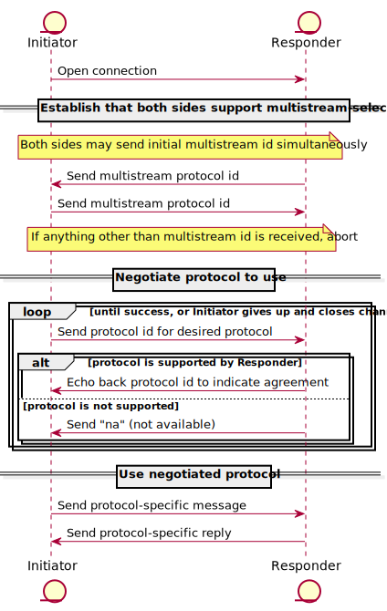

# Connection Establishment in libp2p

| Lifecycle Stage | Maturity      | Status | Latest Revision |
|-----------------|---------------|--------|-----------------|
| 1A              | Working Draft | Active | r0, 2019-06-20  |

Authors: [@yusefnapora]

Interest Group: [@JustMaier], [@vasco-santos] [@bigs], [@mgoelzer]

[@yusefnapora]: https://github.com/yusefnapora
[@JustMaier]: https://github.com/JustMaier
[@vasco-santos]: https://github.com/vasco-santos
[@bigs]: https://github.com/bigs
[@mgoelzer]: https://github.com/mgoelzer

See the [lifecycle document][lifecycle-spec] for context about the maturity level
and spec status.

[lifecycle-spec]: https://github.com/libp2p/specs/blob/master/00-framework-01-spec-lifecycle.md

## Table of Contents

- [Connection Establishment in libp2p](#connection-establishment-in-libp2p)
    - [Table of Contents](#table-of-contents)
    - [Overview](#overview)
    - [Definitions](#definitions)
    - [Protocol Negotiation](#protocol-negotiation)
        - [multistream-select](#multistream-select)
    - [Upgrading Connections](#upgrading-connections)
    - [Opening New Streams Over a Connection](#opening-new-streams-over-a-connection)
    - [Practical Considerations](#practical-considerations)
        - [Interoperability](#interoperability)
        - [State Management](#state-management)
            - [Peer Metadata Storage](#peer-metadata-storage)
            - [Connection Limits](#connection-limits)
        - [Connection Lifecycle Events](#connection-lifecycle-events)
    - [Hole punching](#hole-punching)
    - [Future Work](#future-work)

## Overview

This document describes the process of establishing connections to new peers in
libp2p and, if necessary, adding security and stream multiplexing capabilities
to "raw" connections provided by transport protocols.

We also discuss opening new streams over an existing connection, and the
protocol negotiation process that occurs to route traffic to the correct
protocol handler.

This document does not cover the establishment of "transport level" connections,
for example opening "raw" TCP sockets, as those semantics are specific to each
transport.

What is covered here is the process that occurs after making the initial
transport level connection, up to the point where "application level" streams
are opened, and their protocols are identified and data is routed appropriately
to handler functions.


## Definitions

A **connection** is a reliable, bidirectional communication channel between two
libp2p peers that provides **security** and the ability to open multiple
logically independent **streams**.

**Security** in this context means that all communications (after an initial
handshake) are encrypted, and that the identity of each peer is cryptographically
verifiable by the other peer.

**Streams** are reliable, bidirectional channels that are multiplexed over a
libp2p connection. They must support backpressure, which prevents receivers from
being flooded by data from eager senders. They can also be "half closed",
meaning that a stream can be closed for writing data but still open to receiving
data and vice versa.

Support for multiple streams ensures that a single connection between peers can
support a wide variety of interactions, each with their own protocol. This is
especially helpful if connections are difficult to establish due to NAT
traversal issues or other connectivity barriers.

Connections take place over an underlying **transport**, for example TCP
sockets, websockets, or various protocols layered over UDP.

While some transport protocols like [QUIC][quic-spec] have "built in" security
and stream multiplexing, others such as TCP need to have those capabilities
layered on top of the "raw" transport connection.

When the base capabilities of security and stream multiplexing are not natively
supported by the underlying transport protocol, a **connection upgrade** process
occurs to augment the raw transport connection with the required features.

libp2p peers can both initiate connections to other peers and accept incoming
connections. We use the term **dial** to refer to initiating outbound
connections, and **listen** to refer to accepting inbound connections.

## Protocol Negotiation

One of libp2p's core design goals is to be adaptable to many network
environments, including those that don't yet exist. To provide this flexibility,
the connection upgrade process supports multiple protocols for connection
security and stream multiplexing and allows peers to select which to use for
each connection.

The process of selecting protocols is called **protocol negotiation**. In
addition to its role in the connection upgrade process, protocol negotiation is
also used whenever [a new stream is opened over an existing
connection](#opening-new-streams-over-a-connection). This allows libp2p
applications to route application-specific protocols to the correct handler
functions.

Each protocol supported by a peer is identified using a unique string called a
**protocol id**. While any string can be used, the conventional format is a
path-like structure containing a short name and a version number, separated by
`/` characters. For example: `/yamux/1.0.0` identifies version 1.0.0 of the
[`yamux` stream multiplexing protocol][yamux]. multistream-select itself has a
protocol id of `/multistream/1.0.0`.

Including a version number in the protocol id simplifies the case where you want
to concurrently support multiple versions of a protocol, perhaps a stable version
and an in-development version. By default, libp2p will route each protocol id
to its handler function using exact literal matching of the protocol id, so new
versions will need to be registered separately. However, the handler function
receives the protocol id negotiated for each new stream, so it's possible to
register the same handler for multiple versions of a protocol and dynamically alter
functionality based on the version in use for a given stream.

### multistream-select

libp2p uses a protocol called multistream-select for protocol negotiation. Below
we cover the basics of multistream-select and its use in libp2p. For more
details, see [the multistream-select repository][mss].

Before engaging in the multistream-select negotiation process, it is assumed
that the peers have already established a bidirectional communication channel,
which may or may not have the security and multiplexing capabilities of a libp2p
connection. If those capabilities are missing, multistream-select is used in the
[connection upgrade process](#upgrading-connections) to determine how to provide
them.

Messages are sent encoded as UTF-8 byte strings, and they are always followed by
a `\n` newline character. Each message is also prefixed with its length in bytes
(including the newline), encoded as an unsigned variable-length integer
according to the rules of the [multiformats unsigned varint spec][uvarint].

For example, the string `"na"` is sent as the following bytes (shown here in
hex):

```
0x036e610a
```
The first byte is the varint-encoded length (`0x03`), followed by `na` (`0x6e 0x61`),
then the newline (`0x0a`).


The basic multistream-select interaction flow looks like this:



Let's walk through the diagram above. The peer initiating the connection is
called the **Initiator**, and the peer accepting the connection is the
**Responder**.

The Initiator first opens a channel to the Responder. This channel could either be a
new connection or a new stream multiplexed over an existing connection.

Next, both peers will send the multistream protocol id to establish that they
want to use multistream-select. Both sides may send the initial multistream
protocol id simultaneously, without waiting to receive data from the other side.
If either side receives anything other than the multistream protocol id as the
first message, they abort the negotiation process.

Once both peers have agreed to use multistream-select, the Initiator sends the
protocol id for the protocol they would like to use. If the Responder supports
that protocol, it will respond by echoing back the protocol id, which signals
agreement. If the protocol is not supported, the Responder will respond with the
string `"na"` to indicate that the requested protocol is Not Available.

If the peers agree on a protocol, multistream-select's job is done, and future
traffic over the channel will adhere to the rules of the agreed-upon protocol.

If a peer receives a `"na"` response to a proposed protocol id, they can either
try again with a different protocol id or close the channel.


## Upgrading Connections

libp2p is designed to support a variety of transport protocols, including those
that do not natively support the core libp2p capabilities of security and stream
multiplexing. The process of layering capabilities onto "raw" transport
connections is called "upgrading" the connection.

Because there are many valid ways to provide the libp2p capabilities, the
connection upgrade process uses protocol negotiation to decide which specific
protocols to use for each capability. The protocol negotiation process uses
multistream-select as described in the [Protocol
Negotiation](#protocol-negotiation) section.

When raw connections need both security and multiplexing, security is always
established first, and the negotiation for stream multiplexing takes place over
the encrypted channel.

Here's an example of the connection upgrade process:


First, the peers both send the multistream protocol id to establish that they'll
use multistream-select to negotiate protocols for the connection upgrade.

Next, the Initiator proposes the [TLS protocol][tls-libp2p] for encryption, but
the Responder rejects the proposal as they don't support TLS.

The Initiator then proposes the [Noise protocol][noise-spec], which is supported
by the Responder. The Listener echoes back the protocol id for Noise to indicate
agreement.

At this point the Noise protocol takes over, and the peers exchange the Noise
handshake to establish a secure channel. If the Noise handshake fails, the
connection establishment process aborts. If successful, the peers will use the
secured channel for all future communications, including the remainder of the
connection upgrade process.

Once security has been established, the peers negotiate which stream multiplexer
to use. The negotiation process works in the same manner as before, with the
dialing peer proposing a multiplexer by sending its protocol id, and the
listening peer responding by either echoing back the supported id or sending
`"na"` if the multiplexer is unsupported.

Once security and stream multiplexing are both established, the connection
upgrade process is complete, and both peers are able to use the resulting libp2p
connection to open new secure multiplexed streams.

Note: In the case where both peers initially act as initiators, e.g. during NAT
hole punching, tie-breaking is done via the [multistream-select simultaneous
open protocol extension][simopen].


## Opening New Streams Over a Connection

Once we've established a libp2p connection to another peer, new streams are
multiplexed over the connection using the native facilities of the transport, or
the stream multiplexer negotiated during the [upgrade
process](#upgrading-connections) if the transport lacks native multiplexing.
Either peer can open a new stream to the other over an existing connection.

When a new stream is opened, a protocol is negotiated using
`multistream-select`. The [protocol negotiation process](#protocol-negotiation)
for new streams is very similar to the one used for upgrading connections.
However, while the security and stream multiplexing modules for connection
upgrades are typically libp2p framework components, the protocols negotiated for
new streams can be easily defined by libp2p applications.

Streams are routed to application-defined handler functions based on their
protocol id string. Incoming stream requests will propose a protocol id to use
for the stream using `multistream-select`, and the peer accepting the stream
request will determine if there are any registered handlers capable of handling
the protocol. If no handlers are found, the peer will respond to the proposal
with `"na"`.

When registering protocol handlers, it's possible to use a custom predicate or
"match function", which will receive incoming protocol ids and return a boolean
indicating whether the handler supports the protocol. This allows more flexible
behavior than exact literal matching, which is the default behavior if no match
function is provided.

## Practical Considerations

This section will go over a few aspects of connection establishment and state
management that are worth considering when implementing libp2p.

### Interoperability

Support for connection security protocols and stream multiplexers varies across
libp2p implementations. To support the widest variety of peers, implementations
should support a baseline "stack" of security and multiplexing protocols.

The recommended baseline **security** protocol is [Noise][noise-spec], which is
supported in all current libp2p implementations.

The recommended baseline **stream multiplexer** is [yamux][yamux], which
provides a very simple programmatic API and is supported in most libp2p
implementations.

### State Management

While the connection establishment process itself does not require any
persistent state, some state management is useful to assist bootstrapping and
maintain resource limits.

#### Peer Metadata Storage

It's recommended that libp2p implementations provide a persistent metadata
storage interface that contains at minimum the peer id and last known valid
addresses for each peer. This allows you to more easily "catch
back up" and rejoin a dense network between invocations of your libp2p
application without having to rely on a few bootstrap nodes and random DHT walks
to build up a routing table.

Even during a single invocation of an application, you're likely to benefit from
an in-memory metadata storage facility, which will allow you to cache addresses
for connection resumption. Designing a storage interface which can be backed by
memory or persistent storage will let you swap in whichever is appropriate for
your use case and stage of development.

For examples, see [go-libp2p-peerstore][go-libp2p-peerstore] and
[js-peer-book][js-peer-book].

#### Connection Limits

Maintaining a large number of persistent connections can cause issues with some
network environments and can lead to resource exhaustion and erratic behavior.

It's highly recommended that libp2p implementations maintain an upper bound on
the number of open connections. Doing so while still maintaining robust
performance and connectivity will likely require implementing some kind of
priority mechanism for selecting which connections are the most "expendable"
when you're near the limit.

Resource allocation, measurement and enforcement policies are all an active area
of discussion in the libp2p community, and implementations are free to develop
whatever prioritization system makes sense.

### Connection Lifecycle Events

The establishment of new connections and streams is likely to be a
"cross-cutting concern" that's of interest to various parts of your application
(or parts of libp2p) besides the protocol handlers that directly deal with the
traffic.

For example, the [persistent metadata component](#peer-metadata-storage) could
automatically add peer ids and addresses to its registry whenever a new peer
connects, or a DHT module could update its routing tables when a connection is
terminated.

To support this, it's recommended that libp2p implementations support a
notification or event delivery system that can inform interested parties about
connection lifecycle events.

The full set of lifecycle events is not currently specified, but a recommended
baseline would be:

| Event        | Description                               |
|--------------|-------------------------------------------|
| Connected    | A new connection has been opened          |
| Disconnected | A connection has closed                   |
| OpenedStream | A new stream has opened over a connection |
| ClosedStream | A stream has closed                       |
| Listen       | We've started listening on a new address  |
| ListenClose  | We've stopped listening on an address     |

## Hole punching

See [hole punching][hole-punching] document.

## Future Work

A replacement for multistream-select is [being discussed][mss-2-pr] which
proposes solutions for several inefficiencies and shortcomings in the current
protocol negotiation and connection establishment process. The ideal outcome of
that discussion will require many changes to this document, once the new
multistream semantics are fully specified.

For connection management, there is currently a draft of a [connection manager
specification][connmgr-v2-spec] that may replace the current [connmgr
interface][connmgr-go-interface] in go-libp2p and may also form the basis of
other connection manager implementations. There is also [a
proposal][resource-manager-issue] for a more comprehensive resource management
system, which would track and manage other finite resources as well as
connections.

Also related to connection management, libp2p has recently added support for
[QUIC][quic-spec], a transport protocol layered on UDP that can resume sessions
with much lower overhead than killing and re-establishing a TCP connection. As
QUIC and other "connectionless" transports become more widespread, we want to
take advantage of this behavior where possible and integrate lightweight session
resumption into the connection manager.

Event delivery is also undergoing a refactoring in go-libp2p, with work on an
[in-process event bus][go-eventbus] in progress now that will augment (and
perhaps eventually replace) the current [notification system][go-net-notifee].

One of the near-term goals of the event bus refactor is to more easily respond
to changes in the protocols supported by a remote peer. Those changes are
communicated over the wire using the [identify/push protocol][identify-push].
Using an event bus allows other, unrelated components of libp2p (for
example, a DHT module) to respond to changes without tightly coupling components
together with direct dependencies.

While the event bus refactoring is specific to go-libp2p, a future spec may
standardize event types used to communicate information across key libp2p
subsystems, and may possibly require libp2p implementations to provide an
in-process event delivery system. If and when this occurs, this spec will be
updated to incorporate the changes.

[mss]: https://github.com/multiformats/multistream-select
[uvarint]: https://github.com/multiformats/unsigned-varint
[yamux]: https://github.com/hashicorp/yamux/blob/master/spec.md
[noise-spec]: ../noise/README.md
[connmgr-v2-spec]: https://github.com/libp2p/specs/pull/161
[connmgr-go-interface]: https://github.com/libp2p/go-libp2p-core/blob/master/connmgr/connmgr.go
[tls-libp2p]: ../tls/tls.md
[go-libp2p-peerstore]: https://github.com/libp2p/go-libp2p-peerstore
[js-peer-book]: https://github.com/libp2p/js-peer-book
[quic-spec]: https://datatracker.ietf.org/doc/draft-ietf-quic-transport/
[mss-2-pr]: https://github.com/libp2p/specs/pull/95
[go-eventbus]: https://github.com/libp2p/go-eventbus
[go-net-notifee]: https://github.com/libp2p/go-libp2p-core/blob/master/network/notifee.go
[identify/push]: ../identify/README.md#identify-push
[simopen]: ./simopen.md
[resource-manager-issue]: https://github.com/libp2p/go-libp2p/issues/635
[hole-punching]: ./hole-punching.md
