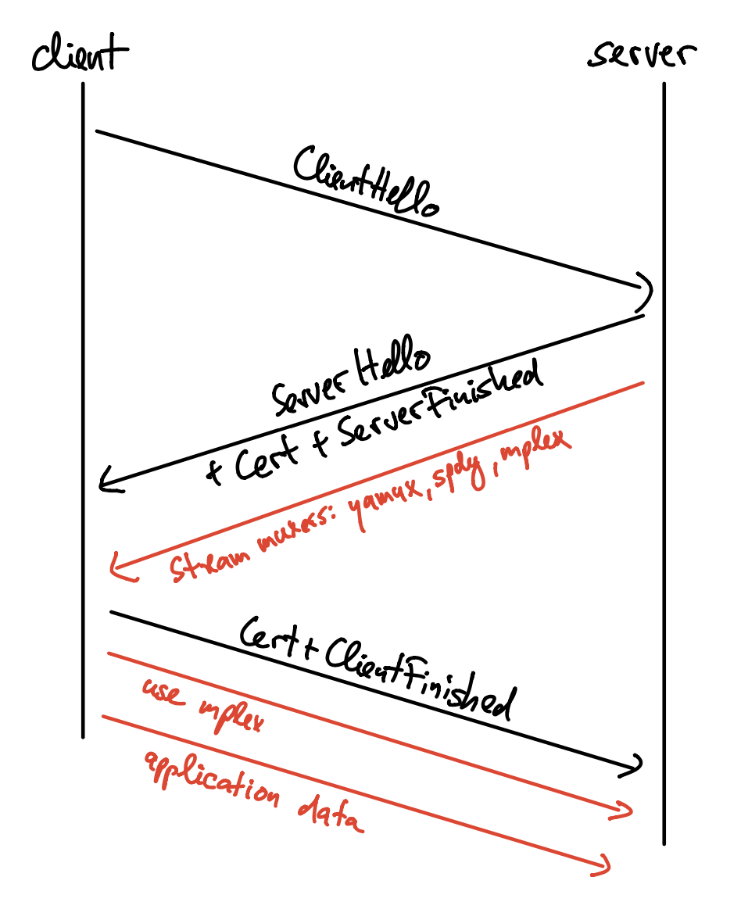

# Multiselect 2.0

## Introduction

Multiselect 2.0 replaces the Multistream protocol. Compared to its predecessor, it offers:

1. Downgrade protection for the security protocol negotiation.
2. Zero-roundtrip stream multiplexer negotiation for handshake protocols that take advantage of early data mechanisms (one-roundtrip negotiation for protocols / implementations that don't).
3. Compression for the protocol identifiers of frequently used protocols.

By using protobufs for all control messages, Multiselect 2.0 provides an easy path for future protocol upgrades. The protobuf format guarantees that unknown fields in a message will be skipped, thus future versions of the protocol can add new fields that signal support for new protocol features.

## High-Level Overview

### Secure Channel Selection

Conversely to multistream-select 1.0, secure channel protocols are not dynamically negotiated in-band. Instead, they are announced upfront in the peer multiaddrs (<add link to multiaddr spec>). This way, implementations can jump straight into a cryptographic handshake, thus curtailing the possibility of packet-inspection-based censorship and dynamic downgrade attacks.

It is up to the implementers to decide whether each secure channel is exposed over a different port, or if a single port handles all secure channels, and a demultiplexing strategy is used to identify which protocol is being used.

**TODO**: Do we need to describe the format here? I guess we don't, but we will probably need another document for that change, and we can link to it from here.

Peers advertising a multiaddr that includes a handshake protocol MUST support Multiselect 2.0 as described in this document.

#### TCP Simultaneous Open

TCP allows the establishment of a connection if two endpoints start initiating a connection at the same time. This is called TCP Simultaneous Open. For libp2p, on the one hand, this poses a problem, since most stream multiplexers assign stream IDs based on the role (client or server) of an endpoint. On the other hand, it can be used as a hole punching technique to facilitate NAT traversal.

TLS as well as Noise will fail the handshake if both endpoints act as clients. In case of such a handshake failure, the two endpoints need to restart the handshake. Endpoints MUST NOT close the underlying TCP connection in this case. Implementations SHOULD specifically test for this type of handshake failure, and not treat any handshake failure as a potential Simultaneous Open.

To determine the roles in the second handshake attempt, endpoints compare the SHA-256 hashes of their peer IDs. The peer with the numerically smaller hash value acts as a client in the second handshake attempt, the peer with the numerically larger hash value acts as a server.

Since secio assign roles during the handshake, it is not possible to detect a Simultaneous Open in this case. Therefore, secio MUST NOT be used with Multiselect 2.0.

### Stream Multiplexer Selection

This section only applies if Multiselect 2 is run over a transport that is not natively multiplexed. Transports that provide stream multiplexing on the transport layer (e.g. QUIC) don't need to do anything described in this section.

Some handshake protocols (TLS 1.3, Noise) support sending of *Early Data*. 

In Multiselect 2 endpoints make use of Early Data to speed up stream multiplexcer selection. As soon as an endpoints reaches a state during the handshake where it can send encrypted application data, it sends a list of supported stream multiplexers. The first entry of the client's list of stream multiplexers is selected, thus the client SHOULD send its list ordered by preference.

When using TLS 1.3, the server can send Early Data after it receives the ClientHello. Early Data is encrypted, but at this point of the handshake the client's identity is not yet verified. 
While Noise in principle allows sending of unencrypted data, endpoints MUST NOT use this to send their list of stream multiplexers. An endpoint MAY send it as soon it is possible to send encrypted data, even if the peers' identity is not verified at that point.

The stream multiplexer that is used in the connection is determined by intersection the lists sent by both endpoints, as follows: First all stream multiplexers that aren't supported by both endpoints are removed from the clients' list of stream multiplexers. The stream multiplexer chosen is then the first element of this list.
If there is no overlap between the two lists, it is not possible to communicate with the peer, and an endpoint MUST close the connection.

Note that this negotiation scheme allows peers to negotiate a "monoplexed" connection, i.e. a connection that doesn't use any stream multiplexer. Endpoints can offer support for monoplexed connections by offering the `/monoplex` stream multiplexer.

**TODO**: Do we need to define a way to send an error code / error string? Or do we have something like that in libp2p already?



Handshake protocols (or implementations of handshake protocols) that don't support sending of Early Data will have to run the stream multiplexer selection after the handshake completes.

#### 0-RTT

When using 0-RTT session resumption as offered by TLS 1.3 and Noise, the endpoints MUST remember the negotiated stream multiplexer used on the original connection. This ensures that the client can send application data in the first flight when resuming a connection.

## Protocol Specification

### Wire Encoding

All messages are Protobuf messages using the `proto3` syntax. Every message is wrapped by the `Multiselect` message:

```protobuf
# Wraps every message
message Multiselect {
    oneof message {
        OfferMultiplexer offerMultiplexer = 1;
        Offer offer = 2;
        Use use = 3;
    }
}
```

This document defines three messages. The first one is the `OfferMultiplexer` message:

```protobuf
# Offer a list of stream multiplexers.
message OfferMultiplexer {
    repeated string name = 1;
}
```

The second one is the `Offer` message:

```protobuf
# Select a list of protocols.
message Offer {
    message Protocol {
        oneof protocol {
            string name = 1;
            uint64 id = 2;
        }
    }
    repeated Protocol protocols = 1;
}
```

And the third one is the `Use` message:

```protobuf
# Declare that a protocol is used on this stream.
# By using an id (instead of a name), an endpoint can provide the peer
# an abbreviation to use for future uses of the same protocol.
message Use {
    message Protocol {
        uint64 id = 1;
        string name = 2;
    }
    Protocol protocol = 1;
}
```

### Protocol Description

The `OfferMultiplexer` message is used to select a stream multiplexer to use on a connection. Each endpoint MUST send this message exactly once as the first message on a transport that does not support native stream multiplexing. This message MUST NOT be sent on transports that support native stream multiplexing (e.g. QUIC), and it MUST NOT be sent at any later moment during the connection.
Once an endpoint has both sent and received the `OfferMultiplexer` message, it determines the stream multiplexer to use on the connection as described in {{stream-multiplexer-selection}}. From this moment, it now has a multiplexed connection that can be used to exchange application data.

An endpoint uses the `Offer` message to initiate a conversation on a new stream. The `Offer` message can be used in two distinct scenarios:
1. The endpoint knows exactly which protocol it wants to use. It then lists this protocol in the `Offer` message.
2. The endpoint wants to use any of a set of protocols, and lets the peer decide which one. It then lists the set of protocols in the `Offer` message.

A `Protocol` is the application protocol spoken on top of an ordered byte stream. The `name` of a protocol is the protocol identifier, e.g. `/ipfs/ping/1.0.0`. The `id` is a numeric abbreviation for this protocol (see below for details how `id`s are assigned).
If the endpoint only selects a single protocol, it MAY start sending application data right after the protobuf message. Since it has not received confirmation if the peer actually supports the protocol, any such data might be lost in that case. If the endpoint selects multiple protocols, it MUST wait for the peer's choice of the application protocol (see description of the `Use` message) before sending application.

The `Use` message is sent in response to the `Offer`. An endpoint MUST treat the receipt of a `Use` message before having sent an `Offer` message on the stream as a connection error.
If none of the protocol(s) listed in the `Offer` message are acceptable, an endpoint MUST reset both the send- and the receive-side of the stream.

If an endpoint receives an  `Offer` message that only offers a single protocol, it accepts this protocol by sending an empty `Use` message (i.e. a message that doesn't list any `protocol`), or a `Use` message that assigns a protocol id (see below). Sending an empty `Use` message in response to an `Offer` message that offers multiple protocols is not permitted, and MUST be treated as a connection error by an endpoint.

If an endpoint receives an `Offer` message that offers multiple protocols, it chooses an application protocol that it would like to speak on this stream. It informs the peer about its choice by sending its selection in the `protocol` field of the `Use` message.

When choosing a protocol, an endpoint can allow its peer to save bytes on the wire for future use of the same protocol by assigning a numeric identifier for the protocol by sending an `id`. The identifier is valid for the lifetime of the connection. The identifier must be unique for the protocol, an endpoint MUST NOT use the same identifier for different protocols.


