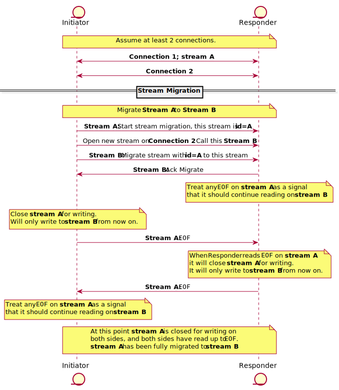
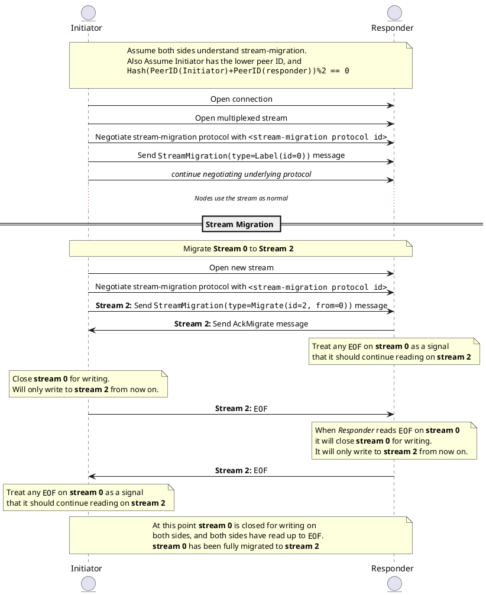

# Stream migration

| Lifecycle Stage | Maturity      | Status | Latest Revision |
|-----------------|---------------|--------|-----------------|
| 1A              | Working Draft | Active | r0, 2022-04-13  |

Authors: [@marcopolo]

Interest Group: TODO
## Introduction

A peer may have many connections open for another peer and may be transmitting
data on less optimal connections. For example a peer could be connected to
another peer both directly and via a relay. In that case we'd like to move any
streams from the relay over to the the better direct connection. A similar
argument can be made with QUIC and TCP.

A peer `A` may also open a connection to another peer `B`, and at roughly the
same time the other peer `B` may open a connection to peer `A`. In this case we
end up with two connections and no protocol to consolidate these connections.

This protocol describes how an abstract stream can be moved from one underlying
stream to another stream (possibly on a different connection). This protocol
enables the peer to prune excess connections since they will no longer be used,
but it does not define how a node should pick which connection to keep and which
to prune, that is left as a topic for another spec.

## Requirements of this protocol

The design of this protocol is informed by the following requirements:
1. Transport agnostic. Really, this means migrating at the stream level.
1. Minimal overhead. Overhead should be at most a small per-stream cost (no
   additional framing, etc.)
1. No interruption. Reading/writing should be continuous.
1. Transparent. Applications using migratable streams shouldn't notice anything.
1. Correct. There can't be any ambiguity (one side believing the migration
   happened, the other side disagreeing, etc.).

## The Protocol

The goal of the protocol is to move traffic from one stream to another
seamlessly. The final state of the new stream should be the same as the initial
state of the old stream.

The protocol should only be used when the initiator knows the responder
understands the stream-migration protocol. Otherwise we waste 1 round trip.

The protocol works as a prefix before another protocol. If we are creating a
stream for some user protocol `P`, we coordinate the stream-migration protocol
first, and then negotiate protocol `P` later. The stream-migration protocol
assigns an ID for the stream with the `Label` or `Migrate` message so that both
sides can know the ID for the stream. This way when a peer decides to migrate
the stream later on, it can reference which stream it wants to migrate and both
peers know which stream is being referenced.



<details>
  <summary>Instructions to reproduce diagram</summary>



To generate:
```bash
plantuml stream-migration.md -o stream-migration -tsvg
```
</details>

The responder may choose to deny the migration by responding with the AckMigrate
message and setting the deny_migrate field to true. In which case, the new
stream should be closed and the initiator should not make future attempts to
migrate this stream. A stream reset before an AckMigrate should be interpreted
by the initiator as a sign it should try again later.

### Stream Migration Protocol ID
The protocol id should be `/libp2p/stream-migration`.

### Stream IDs

Stream IDs are a uint64. They are defined by the stream initiator and conveyed to
the responder in the `StreamMigration` message. The ID should be unique to the
nodes involved. Even across connections. In other words, for two peers A and B,
every labelled stream between them should have a unique uint64 ID. To ensure
that this is true across implementations IDs generated by the lower peer id
should be even, and IDs generated by the higher peer ID should be odd.

Here is a possible strategy that implementors could use when labelling a
stream, but is not required as long as the above invariants hold true.
 1. Define an atomic uint64 as a counter.
 1. Grab and increment the counter, call this `ID`.
 1. Bitshift the `ID` by one.
 1. Check if we are the lower peer ID.
    1. If yes, do nothing
    1. If no, add one to the `ID`
 1. Use `ID` as the ID for the stream.

### Stream Migration Messages

Messages for stream migration are Protobuf messages defined in
[./stream-migration/streammigration.proto](./stream-migration/streammigration.proto).

The first StreamMigration message sent over the wire by the stream initiator can
be one of:
1. Label. This labels this stream with an ID (defined above).
1. Migrate. This starts the migration from a given id to this stream, it also
   labels the stream with an ID.

The responder should only respond to the `Migrate` message with a `AckMigrate`
message that may optionally deny the migration.

## Who moves the stream

For simplicity and to avoid handling edge cases (what if both peers try
migrating at the same time?), we define a way for both nodes to agree on who is
responsible for initiating stream migration. Only this node will start a stream
migration, but either node can start and label a stream.

To decide which one of two nodes is responsible for stream migration:
1. Take the hash of the concatenated value of the lower peer ID with the higher
   peer ID. E.g. for peer `A` and peer `B` we evaluate `SHA256(A+B)`.
1. If the hash is even, the lower peer id is responsible for stream migration.
1. Otherwise, the higher peer id is responsible for stream migration. To
   continue the example, `SHA256("AB")` ends with `c`, so it's even and peer A
   is responsible for stream migration.

The hash of the two peer ids is used to avoid biasing the protocol to assigning
more responsibilities to peers with lower ids.

## Picking the best connection

Picking the best connection to migrate streams towards is outside the scope of
this protocol. However, it's important to note that only the initiator of the
stream migration is concerned with which connection to pick. Both sides do not
have to have the same deterministic notion of what is best.

### Resets

If either stream is "reset" before both ends are closed, both streams must be
reset and the stream as a whole should be considered "aborted" (reset).

### Half closed streams

The final migrated stream should look the same as the initial stream. If the
initial stream `1` was half closed, then the final migrated stream `2` should
also be half closed. Note this may involve an extra step by one of the nodes.
If a node, had closed writes to its old stream before migration it should also
close writes to the new stream after migration.

## Appendix

[Specs Issue](https://github.com/libp2p/specs/issues/328)

### Related Issues:

- <https://github.com/libp2p/go-libp2p/issues/634>

## Open Questions

Some questions that will probably be resolved when a PoC is implemented.