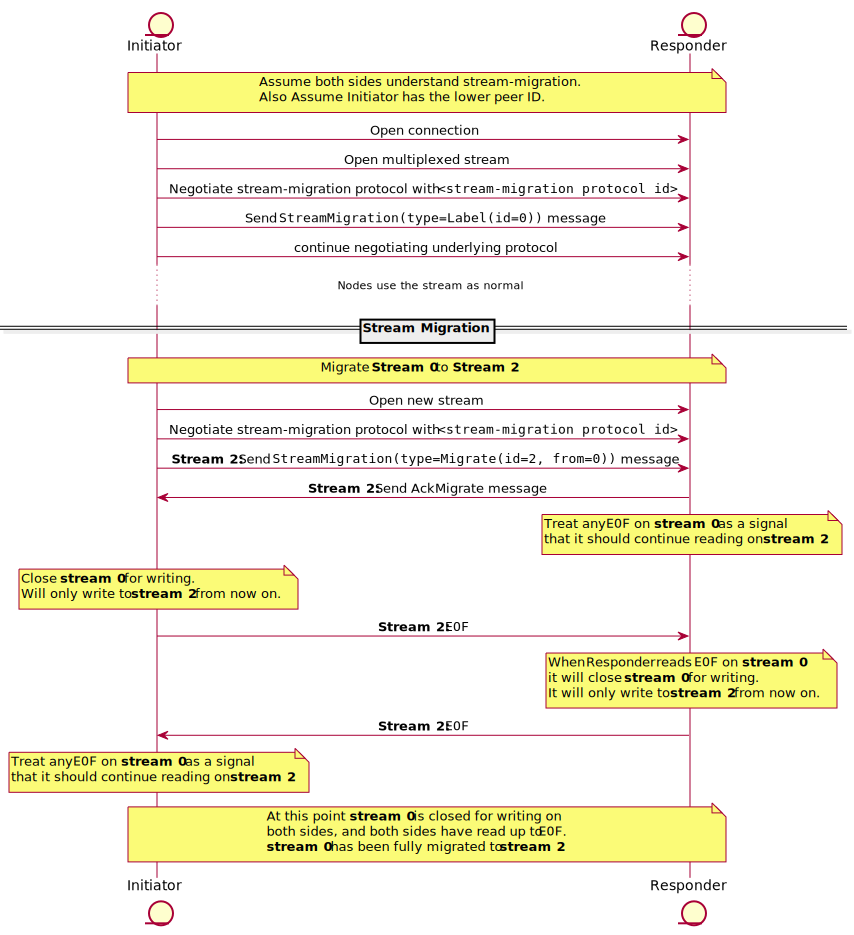

# Stream migration

| Lifecycle Stage | Maturity      | Status | Latest Revision |
|-----------------|---------------|--------|-----------------|
| 1A              | Working Draft | Active | r0, 2022-04-13  |

Authors: [@marcopolo]

Interest Group: TODO
## Introduction

A peer may have many connections open for another peer and may be transmitting
data on less optimal connections. For example a peer could be connected to
another peer both directly and via a relay. In that case we'd like to move any
streams from the relay over to the the better direct connection. A similar
argument can be made with QUIC and TCP.

This protocol attempts to solve the problem of how to seamlessly move a stream
from one connection to another. This protocol also enables the peer to prune
excess connections since they will no longer be used.

## Requirements

1. Transport agnostic. Really, this means migrating at the stream level.
1. Minimal overhead. Overhead should be at most a small per-stream cost (no additional framing, etc.)
1. No interruption. Reading/writing should be continuous.
1. Transparent. Applications using migratable streams shouldn't notice anything.
1. Correct. There can't be any ambiguity (one side believing the migration happened, the other side disagreeing, etc.).

## The Protocol
The goal of the protocol is to move traffic from one stream to another
seamlessly. The final state of the new stream should be the same as the initial
state of the old stream.

The protocol should only be used when the initiator knows the responder
understands the stream-migration protocol (otherwise you'll waste a roundtrip).

The protocol works as a prefix before another protocol. If we are creating a
stream for some user protocol `P`, we coordinate the stream-migration protocol
first, and then negotiate protocol `P` later. The initial stream-migration
negotiation is so that both sides agree on an ID for the stream. This way when a
peer decides to migrate the stream, it can reference which stream it wants to
migrate and both peers know which stream is being referenced.



<details>
  <summary>Instructions to reproduce diagram</summary>


To generate:
```bash
plantuml stream-migration.md -o stream-migration -tsvg
```
</details>

Note: some of these steps may be pipelined.


### Stream IDs

In the above diagram stream IDs have the labels `A` and `B`. In practice this
ID will be represented as a uint32 defined by the initiator.

### Stream migration protocol id

The stream migration protocol id should follow be `/libp2p/streamMigration`.


### Resets

If either stream is "reset" before both ends are closed, both streams must be
reset and the stream as a whole should be considered "aborted" (reset).

### Half closed streams

The final migrated stream should look the same as the initial stream. If the
initial stream `A` was half closed, then the final migrated stream `B` should
also be half closed. Note this may involve an extra step by one of the nodes.
If a node, when trying to close writes to its old stream, notices that it was
already closed, it should also close the new stream for writing. Specifically
imagine the following case.


<details>
  <summary>Instructions to reproduce diagram</summary>

To generate:
```bash
plantuml stream-migration.md -o stream-migration -tsvg
```
</details>

The reverse case where the Initiator's stream is closed for writing is the same
as above, but mirrored.

## Picking the best connection

Moving streams from one connection to another involves picking which connection
we should move the streams to. Here are some recommended heuristics the
initiator may use in determining which connection is best.

1. If we have both relayed and direct connections, keep the direct connections
   and drop the relay connections.
2. Check for simultaneous connect: If we have both inbound and outbound
   connections, keep the ones initiated by the peer with the lowest peer ID. Open
   Question: Some protocols behave differently depending on whether they are the
   dialer or listener. Can we really consolidate these?
3. Prefer the connection with the most streams.
4. Break ties in the remaining connections by selecting the newest conn, to
   match the swarm's behavior in best connection selection.

Note that it's not required that all implementations (and all versions) follow
the same heuristics since the initiator is driving the migration and specifies
where to migrate to.

## Appendix

[Specs Issue](https://github.com/libp2p/specs/issues/328)

### Related Issues:

- <https://github.com/libp2p/go-libp2p/issues/634>

## Open Questions

Some questions that will probably be resolved when a PoC is implemented.

- In simultaneous open how do we pick who's the initiator? I think we can rely
  on the `/libp2p/simultaneous-connect` to do the correct thing here.