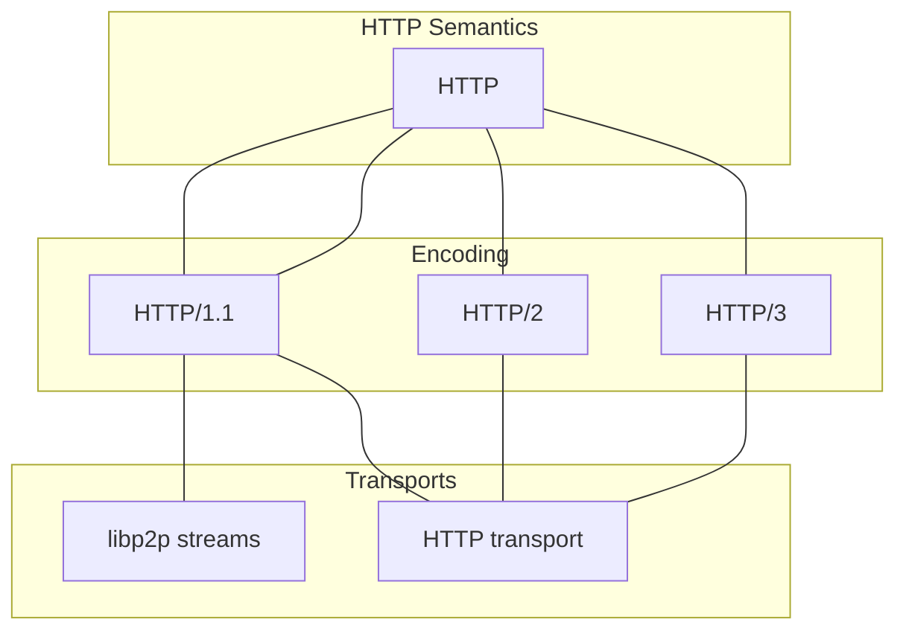

# HTTP

| Lifecycle Stage | Maturity      | Status | Latest Revision |
| --------------- | ------------- | ------ | --------------- |
| 1A              | Working Draft | Active | r0, 2023-01-23  |

Authors: [@marten-seemann], [@MarcoPolo]

Interest Group: [@lidel], [@thomaseizinger]

[@marten-seemann]: https://github.com/marten-seemann
[@MarcoPolo]: https://github.com/MarcoPolo
[@lidel]: https://github.com/lidel
[@thomaseizinger]: https://github.com/thomaseizinger

## Introduction

This document defines how libp2p nodes can offer and use an HTTP transport alongside their other transports to support application protocols with HTTP semantics. This allows a wider variety of nodes to participate in the libp2p network, for example:

- Browsers communicating with other libp2p nodes without needing a WebSocket, WebTransport, or WebRTC connection.
- HTTP only edge workers can run application protocols and respond to peers on the network.
- `curl` from the command line can make requests to other libp2p nodes.

The HTTP transport will also allow application protocols to make use of HTTP intermediaries such as HTTP caching, and layer 7 proxying and load balancing. This is all in addition to the existing features that libp2p provides such as:

- Connectivity – Work on top of WebRTC, WebTransport, QUIC, TCP, or an HTTP transport.
- Hole punching – Work with peers behind NATs.
- Peer ID Authentication – Authenticate your peer by their libp2p peer id.
- Peer discovery – Learn about a peer given their peer id.

## HTTP Semantics vs Encodings vs Transport

HTTP is a bit of an overloaded term. This section aims to clarify what we’re talking about when we say “HTTP”.




- *HTTP semantics* ([RFC 9110](https://www.rfc-editor.org/rfc/rfc9110.html)) is
  the stateless application-level protocol that you work with when writing HTTP
  apis (for example).

- *HTTP encoding* is the thing that takes your high level request/response
  defined in terms of HTTP semantics and encodes it into a form that can be sent
  over the wire.

- *HTTP transport* is the thing that takes your encoded reqeust/response and
  sends it over the wire. For HTTP/1.1 and HTTP/2, this is a TCP+TLS connection.
  For HTTP/3, this is a QUIC connection.

When this document says *HTTP* it is generally referring to *HTTP semantics*.

## Interoperability with existing HTTP systems

A goal of this spec is to allow libp2p to be able to interoperate with existing HTTP servers and clients. Care is taken in this document to not introduce anything that would break interoperability with existing systems.

## HTTP Transport

Nodes MUST use HTTPS (i.e., they MUST NOT use plaintext HTTP). It is RECOMMENDED to use HTTP/2 and HTTP/3.

Nodes signal support for their HTTP transport using the `/http` component in
their multiaddr. E.g., `/dns4/example.com/tls/http`. See the [HTTP multiaddr
component spec](https://github.com/libp2p/specs/pull/550) for more details.

## Namespace

libp2p does not squat the global namespace. libp2p application protocols can be discovered by the [well-known resource](https://www.rfc-editor.org/rfc/rfc8615) `.well-known/libp2p`. This allows server operators to dynamically change the URLs of the application protocols offered, and not hard-code any assumptions how a certain resource is meant to be interpreted.

```json

{
    "protocols": {
        "/kad/1.0.0": {"path": "/kademlia/"},
        "/ipfs-http/1.0.0": {"path": "/"},
    }
}
```

The resource contains a mapping of application protocols to their respective URL. For example, this configuration file would tell a client

1. That the Kademlia protocol is available at `/kademlia` and
2. The [IPFS Trustless Gateway API](https://specs.ipfs.tech/http-gateways/trustless-gateway/) is mounted at `/`.

It is valid to expose a service at `/`. It is RECOMMENDED that implementations facilitate the coexistence of different service endpoints by ensuring that more specific URLs are resolved before less specific ones. For example, when registering handlers, more specific paths like `/kademlia/foo` should take precedence over less specific handler, such as `/`.

## Peer ID Authentication

When using the HTTP Transport, peer id authentication is optional. You only pay for it if you need it. This benefits use cases that don’t need peer authentication (e.g., fetching content addressed data) or authenticate some other way (not tied to libp2p peer ids).

Peer ID authentication in the HTTP Transport follows a similar to pattern to how
libp2p adds Peer ID authentication in WebTransport and WebRTC. We run the
standard libp2p Noise handshake, but using `IX` for client and server
authentication or `NX` for just server authentication.

Note: This is just one form of Peer ID authentication. Other forms may be added
in the future (with a different `WWW-Authenticate` value) or be added to the
application protocols themselves.

### Authentication flow

1. The client initiates a request that it knows must be authenticated OR the client responds to a `401` with the header `WWW-Authenticate: Libp2p-Noise-IX` (The server MAY also include `Libp2p-Token` as an authentication scheme).
2. The client sets the `Authorization`
   [header](https://www.rfc-editor.org/rfc/rfc9110.html#section-11.6.2) to
   `Libp2p-Noise-IX <multibase-encoded-noise-protobuf>`  (or `Libp2p-Noise-NX`
   if not doing client authentication). This initiates the
   `IX` or `NX` handshake.
    1. The protobuf is multibase encoded, but clients MUST only use encodings that are HTTP header safe (refer to to the [token68 definition](https://www.rfc-editor.org/rfc/rfc9110.html#section-11.2)). To set the minimum bar for interoperability, clients and servers MUST support base32 encoding (”b” in the multibase table).
    2. When the server receives this request and `IX` was used, it can authenticate the client.
3. The server responds with `Authentication-Info` field set to
   `Libp2p-Noise-<PATTERN> <multibase-encoding-noise-protobuf-response>`. Where
   `<PATTERN>` is either `IX` or `NX`.
    1. The server MUST include the SNI used for the connection in the [Noise extensions](https://github.com/libp2p/specs/blob/master/noise/README.md#noise-extensions).
    2. The server MAY include a token in the Noise extensions that the client
    can use to avoid doing another Noise handshake in the future. The client
    would use this token by setting the `Authorization` header to `Libp2p-Token
    <token>`.
    3. When the client receives this response, it can authenticate the server’s peer ID.
4. The client verifies the SNI in the Noise extension matches the one used to initiate the connection. The client MUST close the connection if they differ.
    1. The client SHOULD remember this connection is authenticated.
    2. The client SHOULD use the `Libp2p-Token` if provided for future authorized requests.

This costs one round trip, but can piggy back on an appropriate request.

### Authentication Endpoint

Because the client needs to make a request to authenticate the server, and the client may not want to make the real request before authenticating the server, the server MAY provide an authentication endpoint. This authentication endpoint is like any other application protocol, and it shows up in `.well-known/libp2p`, but it only does the authentication flow. It doesn’t send any other data besides what is defined in the above Authentication flow. The protocol id for the authentication endpoint is `/http-noise-auth/1.0.0`.

## Using HTTP semantics over stream transports

Application protocols using HTTP semantics can run over any libp2p stream transport. Clients open a new stream using `/http/1.1` as the protocol identifer. Clients encode their HTTP request as an HTTP/1.1 message and send it over the stream. Clients parse the response as an HTTP/1.1 message and then close the stream.

HTTP/1.1 is chosen as the minimum bar for interoperability, but other encodings of HTTP semantics are possible as well and may be specified in a future update.

## Using other request-response semantics (not HTTP)

This document has focused on using HTTP semantics, but HTTP may not be the common divisor amongst all transports (current and future). It may be desirable to use some other request-response semantics for your application-level protocol, perhaps something like rust-libp2p’s [request-response](https://docs.rs/libp2p/0.52.1/libp2p/request_response/index.html) abstraction. Nothing specified in this document prohibits mapping other semantics onto HTTP semantics to keep the benefits of using an HTTP transport.

To support the simple request-response semantics, for example, the request MUST be encoded within a `POST` request to the proper URL (as defined in the Namespace section). The response is read from the body of the HTTP response. The client MUST authenticate the server and itself **before** making the request.
