# Peer ID Authentication over HTTP

| Lifecycle Stage | Maturity      | Status | Latest Revision |
| --------------- | ------------- | ------ | --------------- |
| 1A              | Working Draft | Active | r0, 2023-01-23  |

Authors: [@MarcoPolo]

Interest Group: [@sukunrt], [@achingbrain]

## Introduction

This spec defines an HTTP authentication scheme of libp2p Peer IDs in accordance
with [RFC 9110](https://datatracker.ietf.org/doc/html/rfc9110). The
authentication scheme is called `libp2p-PeerID`.

## Protocol Overview

At a high level, challenges are exchanged and signed by each peer to
authenticate themselves to each other. The protocol works whether the Client
provides the first challenge, or the Server provides the first challenge.

Example Diagram of Server initiated handshake

```
┌─────────┐                   ┌────────┐
│ Client  │                   │ Server │
└─────────┘                   └────────┘
     │   initial request           │
     ├────────────────────────────>│
     │                             │
     │   401; challenge-client     │
     │<────────────────────────────┤
     │                             │
     │   client-sig +              │
     │   challenge-server          │
     │   [client authenticated]    │
     ├────────────────────────────>│
     │                             │
     │   server-sig                │
     │   [server authenticated]    │
     │<────────────────────────────┤
     │                             │
     │   application data          │
     ├────────────────────────────>│
     │                             │
     │   resp                      │
     │<────────────────────────────┤
```

Example Diagram of Client initiated handshake

```
┌────────┐                    ┌────────┐
│ Client │                    │ Server │
└────────┘                    └────────┘
     │   challenge-server          │
     ├────────────────────────────>│
     │                             │
     │   challenge-client +        │
     │   server-sig                │
     │   [server authenticated]    │
     │<────────────────────────────┤
     │                             │
     │   client-sig +              │
     │   application data          │
     │   [client authenticated]    │
     ├────────────────────────────>│
     │                             │
     │   resp                      │
     │<────────────────────────────┤
```

## Parameters

| Param Name       | Description                                                                                                                                                |
| ---------------- | ---------------------------------------------------------------------------------------------------------------------------------------------------------- |
| hostname         | The server name used in the TLS connection (SNI).                                                                                                          |
| challenge-server | The random quoted string value the client generates to challenge the server to prove its identity                                                          |
| challenge-client | The random quoted string value the server generates to challenge the client to prove its identity                                                          |
| sig              | A base64 encoded signature.                                                                                                                                |
| public-key       | A base64 encoded value of peer's public key. This MUST be the key used for the Peer's Peer ID. The key itself is encoded per the [Peer ID spec].           |
| opaque           | A value opaque to the client blob generated by the server. If a client receives this it must return it. A server may use this to authenticate statelessly. |

Params are encoded per [RFC 9110 auth-param's ABNF](https://datatracker.ietf.org/doc/html/rfc9110#name-cmaollected-abnf). Generally it'll be something like: `hostname="example.com", challenge-server="challenge-string"`

## Signing

Signatures sign some set of parameters prefixed by the string `libp2p-PeerID`.
The parameters are sorted alphabetically, prepended with a varint length
prefix, and concatenated together to form the data to be signed. The parameter
name and value is split with a `=`. The parameter value is appended directly
after the `=`. Strings MUST be UTF-8 encoded. Byte Arrays MUST be appended
as-is. The signing algorithm is defined by the key type used. Refer to the
[Peer ID spec] for specifics on the signing algorithm.

### Signing Example

| Parameter                                                                                   | Value                                                                                                                                                                                                                                                                                                          |
| ------------------------------------------------------------------------------------------- | -------------------------------------------------------------------------------------------------------------------------------------------------------------------------------------------------------------------------------------------------------------------------------------------------------------- |
| hostname                                                                                    | example.com                                                                                                                                                                                                                                                                                                    |
| Server Private Key (pb encoded as hex)                                                      | 0801124001010101010101010101010101010101010101010101010101010101010101018a88e3dd7409f195fd52db2d3cba5d72ca6709bf1d94121bf3748801b40f6f5c                                                                                                                                                                       |
| challenge-server                                                                            | ERERERERERERERERERERERERERERERERERERERERERE=                                                                                                                                                                                                                                                                   |
| Client Public Key (pb encoded as hex)                                                       | 080112208139770ea87d175f56a35466c34c7ecccb8d8a91b4ee37a25df60f5b8fc9b394                                                                                                                                                                                                                                       |
| data to sign ([percent encoded](https://datatracker.ietf.org/doc/html/rfc3986#section-2.1)) | libp2p-PeerID=challenge-server=ERERERERERERERERERERERERERERERERERERERERERE=6client-public-key=%08%01%12%20%819w%0E%A8%7D%17_V%A3Tf%C3L~%CC%CB%8D%8A%91%B4%EE7%A2%5D%F6%0F%5B%8F%C9%B3%94%14hostname=example.com                                                                                                |
| data to sign (hex encoded)                                                                  | 6c69627032702d5065657249443d6368616c6c656e67652d7365727665723d455245524552455245524552455245524552455245524552455245524552455245524552455245524552453d36636c69656e742d7075626c69632d6b65793d080112208139770ea87d175f56a35466c34c7ecccb8d8a91b4ee37a25df60f5b8fc9b39414686f73746e616d653d6578616d706c652e636f6d |
| signature (base64 encoded)                                                                  | UA88qZbLUzmAxrD9KECbDCgSKAUBAvBHrOCF2X0uPLR1uUCF7qGfLPc7dw3Olo-LaFCDpk5sXN7TkLWPVvuXAA==                                                                                                                                                                                                                       |

Note that the `=` after the libp2p-PeerID scheme is the varint length of the challenge-server parameter.

## Base64 Encoding

The base64 encoding follows Base 64 Encoding with URL and Filename Safe
Alphabet from [RFC
4648](https://datatracker.ietf.org/doc/html/rfc4648#section-5). Padding MAY be
omitted. The reason this is not a multibase is to aid clients or servers who
can not or prefer not to import a multibase dependency.

## Public Key Encoding

The authentication below exchanges the peer's public key instead of its PeerID,
as the PeerID alone may not be enough to validate a signature. The Public Key is
encoded per the [Peer ID spec] under the section "Keys" section.

## Mutual Client and Server Peer ID Authentication

The following protocol allows both the client and server to authenticate each
other's Peer ID by having them each sign a challenge issued by the other. The
protocol operates as follows:

### Server Initiated Handshake

1. The client makes an HTTP request to an authenticated resource.

2. The server responds with status code 401 (Unauthorized) and sets the header:

   ```
   WWW-Authenticate: libp2p-PeerID challenge-client="<challenge-string>", public-key="<base64-encoded-public-key-bytes>", opaque="<opaque-value>"
   ```

   The public-key parameter is the server's public key. It is the same public
   key used to derive the server's peer id.

   The opaque parameter is opaque to client. The client MUST return the opaque
   parameter back to the server. The server MAY use the opaque parameter to
   encode state.

3. The client makes another HTTP request to the same authenticated resource and
   sets the header:

   ```
   Authorization: libp2p-PeerID public-key="<base64-encoded-public-key-bytes>", opaque="<opaque-from-server>", challenge-server="<challenge-string>", sig="<base64-signature-bytes>"
   ```

   The public-key parameter is the client's public key. It is the same public
   key used to derive the client's peer id.

   The `sig` param represents a signature over the parameters:

   - `challenge-client`
   - `server-public-key` the bytes of the server's public-key encoded per the [Peer ID spec].
   - `hostname`

4. The server SHOULD verify the signature using the server name used in the TLS
   session. The server MUST return 401 Unauthorized if the server fails to
   validate the signature. If the signature is valid, the server has
   authenticated the client's public key, and thus its PeerID. The server SHOULD
   proceed to serve the HTTP request. The server MUST set the following response
   headers:

   ```
   Authentication-Info: libp2p-PeerID sig="<base64-signature-bytes>" bearer="<base64-encoded-opaque-blob>"
   ```

   The server MAY include an `expires` field which contains the expiry time of
   the bearer token in [RFC 3339](https://www.rfc-editor.org/rfc/rfc3339)
   format:

   ```
   Authentication-Info: libp2p-PeerID sig="<base64-signature-bytes>" bearer="<base64-encoded-opaque-blob>" expires="<RFC-3339-formatted-date-string>"
   ```

   Note that the `expires` field is only advisory, the server may expire the
   token at any time.

   The `sig` param represents a signature over the parameters:

   - `challenge-server`
   - `client-public-key` the bytes of the client's public-key encoded per the [Peer ID spec].
   - `hostname`

   The `bearer` token allows the client to make future Peer ID authenticated
   requests. The value is opaque to the client, and the server may use it to
   store authentication state such as:

   - The client's Peer ID.
   - The `hostname` parameter.
   - The token creation date (to allow tokens to expire).

5. The client MUST verify the signature. After verification the client has
   authenticated the server's Peer ID. The client SHOULD send the `bearer`
   token for Peer ID authenticated requests.

### Client Initiated Handshake

The client initiated version of this handshake follows the same structure,
except that the client sends initially sends a `challenge-server` and the order
of who is authenticated first is reversed. The server MAY ignore the initial
request, and respond by starting the Server initiated handshake.

The client initiated handshake is as follows

1. The client makes an HTTP request to a known authenticated resource and sets
   the header:

   ```
   Authorization: libp2p-PeerID challenge-server="<challenge-string>", public-key="<base64-encoded-public-key-bytes>"
   ```

2. The server responds with status code 401 (Unauthorized) and set the header:

   ```
   WWW-Authenticate: libp2p-PeerID challenge-client="<challenge-string>", public-key="<base64-encoded-public-key-bytes>", sig="<base64-signature-bytes>", opaque="<opaque-value>"
   ```

   The `sig` param represents a signature over the parameters:

   - `challenge-server`
   - `client-public-key` the bytes of the client's public-key encoded per the [Peer ID spec].
   - `hostname`

3. The client MUST verify the signature. After verification the client has
   authenticated the server's Peer ID.

   The client makes another HTTP request to the same authenticated resource and
   sets the header:

   ```
   Authorization: libp2p-PeerID opaque="<opaque-from-server>", sig="<base64-signature-bytes>"
   ```

   The client MAY send application data in this request.

   The `sig` param represents a signature over the parameters:

   - `challenge-client`
   - `server-public-key` the bytes of the server's public-key encoded per the [Peer ID spec].
   - `hostname`

4. The server MUST verify the signature. The server SHOULD verify the signature
   using the server name used in the TLS session. The server MUST return 401
   Unauthorized if the server fails to validate the signature. If the signature
   is valid, the server has authenticated the client's public key, and thus its
   PeerID. The server SHOULD proceed to serve the HTTP request. The server MUST
   set the following response headers:

   ```
   Authentication-Info: libp2p-PeerID bearer="<base64-encoded-opaque-blob>"
   ```

   The `bearer` token allows the client to make future Peer ID authenticated
   requests. The value is opaque to the client, and the server MAY use it to
   store authentication state such as:

   - The client's Peer ID.
   - The `hostname` parameter.
   - The token creation date (to allow tokens to expire).
  
   The server MAY include an `expires` field which contains the expiry time of
   the bearer token in [RFC 3339](https://www.rfc-editor.org/rfc/rfc3339)
   format:

   ```
   Authentication-Info: libp2p-PeerID bearer="<base64-encoded-opaque-blob>" expires="<RFC-3339-formatted-date-string>"
   ```

   Note that the `expires` field is only advisory, the server may expire the
   token at any time.

5. The client SHOULD send the `bearer` token for future Peer ID authenticated
   requests.

## libp2p bearer token

The libp2p bearer token is a token given to the client from the server that
allows the client (the bearer) to make Peer ID authenticated requests to the
server. Once the client receives this token, they SHOULD save it and use it
for future authenticated requests.

The server SHOULD return a 401 Unauthorized and follow the above Mutual
authentication protocol when it wants the client to request a new libp2p
bearer token.

To use the bearer token, the client MUST set the Authorization header as follows:

```
Authorization: libp2p-PeerID bearer="<base64-encoded-opaque-blob>"
```

## Authentication URI Endpoint

Because the client needs to make a request to authenticate the server, and the
client may not want to make the real request before authenticating the server,
the server MAY provide an authentication endpoint. This authentication endpoint
is like any other application protocol, and it shows up in `.well-known/libp2p/protocols`,
but it only does the authentication flow. The client and server SHOULD NOT send
any data besides what is defined in the above authentication flow. The protocol
id for the authentication endpoint is `/http-peer-id-auth/1.0.0`.

## Considerations for Implementations

- Implementations SHOULD only authenticate over a secured connection (i.e. TLS).
- Implementations SHOULD limit the maximum length of any variable length field.
  - The suggested Maximum length of the Authentication related header should is
    2048 bytes.

## Security Considerations

Protection against man-in-the-middle (MITM) type attacks is through Web PKI. If
the client is in an environment where Web PKI can not be fully trusted (e.g. an
enterprise network with a custom enterprise root CA installed on the client),
then this authentication scheme can not protect the client from a MITM attack.

This authentication scheme is also not secure in cases where you do not own
your domain name or the TLS certificate. If someone else can get a valid
certificate for your domain, you may be vulnerable to a MITM attack.

## Complete Server Initiated Handshake Example

The following is a complete and reproducible handshake. Generated by the current
implementation of this spec in go-libp2p. This is a server-initiated handshake.

Understanding the opaque value is not necessary in order to understand the
spec. Servers are free to do whatever they want with the opaque field. The
opaque value represents encoded server state authenticated with an HMAC. The
details can be found in the go-libp2p source.

### Parameters

| Parameter                              | Value                                                                                                                                    |
| -------------------------------------- | ---------------------------------------------------------------------------------------------------------------------------------------- |
| hostname                               | example.com                                                                                                                              |
| Server Private Key (pb encoded as hex) | 0801124001010101010101010101010101010101010101010101010101010101010101018a88e3dd7409f195fd52db2d3cba5d72ca6709bf1d94121bf3748801b40f6f5c |
| Server HMAC Key (hex)                  | 0000000000000000000000000000000000000000000000000000000000000000                                                                         |
| Challenge Client                       | ERERERERERERERERERERERERERERERERERERERERERE=                                                                                             |
| Client Private Key (pb encoded as hex) | 0801124002020202020202020202020202020202020202020202020202020202020202028139770ea87d175f56a35466c34c7ecccb8d8a91b4ee37a25df60f5b8fc9b394 |
| Challenge Server                       | MzMzMzMzMzMzMzMzMzMzMzMzMzMzMzMz                                                                                                         |
| "Now" time                             | 1970-01-01 00:00:00 +0000 UTC                                                                                                            |

### Handshake Diagram



```mermaid
sequenceDiagram
Client->>Server: Initial request
Server->>Client: WWW-Authenticate=libp2p-PeerID challenge-client="ERERERERERERERERERERERERERERERERERERERERERE=", opaque="0H1Y9sq1zrfTJZCCTcTymI2tV_TF9-PzdMip2dFkiqZ7ImNoYWxsZW5nZS1jbGllbnQiOiJFUkVSRVJFUkVSRVJFUkVSRVJFUkVSRVJFUkVSRVJFUkVSRVJFUkVSRVJFPSIsImhvc3RuYW1lIjoiZXhhbXBsZS5jb20iLCJjcmVhdGVkLXRpbWUiOiIxOTY5LTEyLTMxVDE2OjAwOjAwLTA4OjAwIn0="
Client->>Server: Authorization=libp2p-PeerID public-key="CAESIIE5dw6ofRdfVqNUZsNMfszLjYqRtO43ol32D1uPybOU", challenge-server="MzMzMzMzMzMzMzMzMzMzMzMzMzMzMzMz", sig="5RT0BbFdn-hMgE4pQ_GH9tnlKpptGUQZvkh8kVLbwy81Rzli_vfiNOsuGTcMk8lyUfkmTFmk79b5XUZCR3-RBw==", opaque="0H1Y9sq1zrfTJZCCTcTymI2tV_TF9-PzdMip2dFkiqZ7ImNoYWxsZW5nZS1jbGllbnQiOiJFUkVSRVJFUkVSRVJFUkVSRVJFUkVSRVJFUkVSRVJFUkVSRVJFUkVSRVJFPSIsImhvc3RuYW1lIjoiZXhhbXBsZS5jb20iLCJjcmVhdGVkLXRpbWUiOiIxOTY5LTEyLTMxVDE2OjAwOjAwLTA4OjAwIn0="
Note left of Server: Server has authenticated Client
Server->>Client: Authentication-Info=libp2p-PeerID sig="HQ7BJRaSpRhNCORNiALNJENdwXUyq0eM2cxNoxe-XnQw6oEAMaeYnjMYaHHjgq0XNxZmy4W2ngKUcI1CgprLCQ==", bearer="YhlYjHWTMOkTleROtjMiChL7Mx15_GDYfi971mdJCqB7ImlzLXRva2VuIjp0cnVlLCJwZWVyLWlkIjoiMTJEM0tvb1dKV29hcVpoRGFvRUZzaEY3UmgxYnBZOW9oaWhGaHpjVzZkNjlMcjJOQVN1cSIsImhvc3RuYW1lIjoiZXhhbXBsZS5jb20iLCJjcmVhdGVkLXRpbWUiOiIxOTY5LTEyLTMxVDE2OjAwOjAwLTA4OjAwIn0=", public-key="CAESIIqI4910CfGV_VLbLTy6XXLKZwm_HZQSG_N0iAG0D29c"
Note right of Client: Client has authenticated Server

Note over Client: Future requests use the bearer token
Client->>Server: Authorization=libp2p-PeerID bearer="YhlYjHWTMOkTleROtjMiChL7Mx15_GDYfi971mdJCqB7ImlzLXRva2VuIjp0cnVlLCJwZWVyLWlkIjoiMTJEM0tvb1dKV29hcVpoRGFvRUZzaEY3UmgxYnBZOW9oaWhGaHpjVzZkNjlMcjJOQVN1cSIsImhvc3RuYW1lIjoiZXhhbXBsZS5jb20iLCJjcmVhdGVkLXRpbWUiOiIxOTY5LTEyLTMxVDE2OjAwOjAwLTA4OjAwIn0="
```

## Complete Client Initiated Handshake Example

Below is the same as above, but using the client initiated handshake.

### Parameters

| Parameter                              | Value                                                                                                                                    |
| -------------------------------------- | ---------------------------------------------------------------------------------------------------------------------------------------- |
| hostname                               | example.com                                                                                                                              |
| Server Private Key (pb encoded as hex) | 0801124001010101010101010101010101010101010101010101010101010101010101018a88e3dd7409f195fd52db2d3cba5d72ca6709bf1d94121bf3748801b40f6f5c |
| Server HMAC Key (hex)                  | 0000000000000000000000000000000000000000000000000000000000000000                                                                         |
| Challenge Client                       | ERERERERERERERERERERERERERERERERERERERERERE=                                                                                             |
| Client Private Key (pb encoded as hex) | 0801124002020202020202020202020202020202020202020202020202020202020202028139770ea87d175f56a35466c34c7ecccb8d8a91b4ee37a25df60f5b8fc9b394 |
| Challenge Server                       | MzMzMzMzMzMzMzMzMzMzMzMzMzMzMzMz                                                                                                         |
| "Now" time                             | 1970-01-01 00:00:00 +0000 UTC                                                                                                            |

### Handshake Diagram



```mermaid
sequenceDiagram
Client->>Server: Authorization=libp2p-PeerID challenge-server="MzMzMzMzMzMzMzMzMzMzMzMzMzMzMzMz", public-key="CAESIIE5dw6ofRdfVqNUZsNMfszLjYqRtO43ol32D1uPybOU"
Server->>Client: WWW-Authenticate=libp2p-PeerID challenge-client="ERERERERERERERERERERERERERERERERERERERERERE=", public-key="CAESIIqI4910CfGV_VLbLTy6XXLKZwm_HZQSG_N0iAG0D29c", sig="HQ7BJRaSpRhNCORNiALNJENdwXUyq0eM2cxNoxe-XnQw6oEAMaeYnjMYaHHjgq0XNxZmy4W2ngKUcI1CgprLCQ==", opaque="1JrloFj6hobNG859qexB0_odSQlwsb1QSFUMebPJLFp7ImNsaWVudC1wdWJsaWMta2V5IjoiQ0FFU0lJRTVkdzZvZlJkZlZxTlVac05NZnN6TGpZcVJ0TzQzb2wzMkQxdVB5Yk9VIiwiY2hhbGxlbmdlLWNsaWVudCI6IkVSRVJFUkVSRVJFUkVSRVJFUkVSRVJFUkVSRVJFUkVSRVJFUkVSRVJFUkU9IiwiaG9zdG5hbWUiOiJleGFtcGxlLmNvbSIsImNyZWF0ZWQtdGltZSI6IjE5NjktMTItMzFUMTY6MDA6MDAtMDg6MDAifQ=="
Note right of Client: Client has authenticated Server

Client->>Server: Authorization=libp2p-PeerID opaque="1JrloFj6hobNG859qexB0_odSQlwsb1QSFUMebPJLFp7ImNsaWVudC1wdWJsaWMta2V5IjoiQ0FFU0lJRTVkdzZvZlJkZlZxTlVac05NZnN6TGpZcVJ0TzQzb2wzMkQxdVB5Yk9VIiwiY2hhbGxlbmdlLWNsaWVudCI6IkVSRVJFUkVSRVJFUkVSRVJFUkVSRVJFUkVSRVJFUkVSRVJFUkVSRVJFUkU9IiwiaG9zdG5hbWUiOiJleGFtcGxlLmNvbSIsImNyZWF0ZWQtdGltZSI6IjE5NjktMTItMzFUMTY6MDA6MDAtMDg6MDAifQ==", sig="OrwJPO4buHKJdKXP2av8PFwv3XF_-m5MqndskeVV5UzufYzBCTm7RBaFnBS1sEhuQHZSZPh9RJgN5NmLzrUrBQ=="
Note left of Server: Server has authenticated Client
Server->>Client: Authentication-Info=libp2p-PeerID bearer="YhlYjHWTMOkTleROtjMiChL7Mx15_GDYfi971mdJCqB7ImlzLXRva2VuIjp0cnVlLCJwZWVyLWlkIjoiMTJEM0tvb1dKV29hcVpoRGFvRUZzaEY3UmgxYnBZOW9oaWhGaHpjVzZkNjlMcjJOQVN1cSIsImhvc3RuYW1lIjoiZXhhbXBsZS5jb20iLCJjcmVhdGVkLXRpbWUiOiIxOTY5LTEyLTMxVDE2OjAwOjAwLTA4OjAwIn0="
Note over Client: Future requests use the bearer token
```

[Peer ID spec]: https://github.com/libp2p/specs/blob/master/peer-ids/peer-ids.md
[@MarcoPolo]: https://github.com/MarcoPolo
[@sukunrt]: https://github.com/sukunrt
[@achingbrain]: https://github.com/achingbrain
