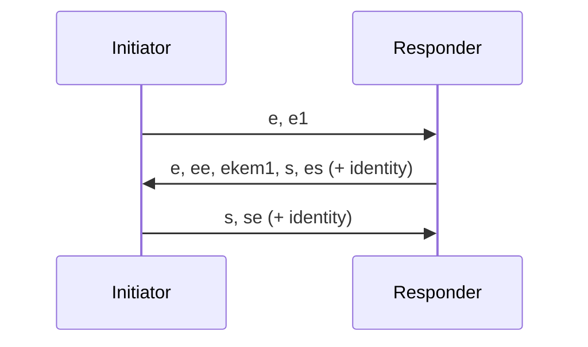

# Hybrid post-quantum Noise (X25519 + ML-KEM-768)

| Lifecycle Stage | Maturity      | Status | Latest Revision |
| --------------- | ------------- | ------ | --------------- |
| 1A              | Working Draft | Active | r0, 2026-07-06  |

Authors: [@royzah]. Interest Group: [@jxs], [@thomaseizinger], [@mxinden],
[@MarcoPolo], [@achingbrain].

## Why

[`/noise`][noise] is X25519 only, so recorded sessions are open to
harvest-now-decrypt-later. This adds a separate handshake that mixes an
ML-KEM-768 KEM into the same `XX` pattern via Noise [HFS][hfs]. It stays secure
if either primitive holds.

Auth is unchanged and stays classical: in libp2p the identity key signs the
static key, so identity cannot be broken after the fact. Only secrecy is at risk,
so only the ephemeral key exchange is hybridized.

## Protocol ID

```text
/noise-mlkem768-hfs/0.1.0
```

Advertised ahead of `/noise`. Two capable peers pick it; otherwise negotiation
falls back to `/noise` with no extra round trip.

## Suite

Mixed into the handshake hash, so it must match byte-for-byte:

```text
Noise_XXhfs_25519+ML-KEM-768_ChaChaPoly_SHA256
```

## Handshake

`XX` with the `hfs` modifier. Token placement and KDF order are exactly Noise
HFS; this spec adds nothing to them.

```text
-> e, e1
<- e, ee, ekem1, s, es
-> s, se
```

- `e1`: initiator sends the ML-KEM-768 encap key (1184 B).
- `ekem1`: responder encapsulates, returns the ciphertext (1088 B), mixes the
  shared secret.

The libp2p identity payload (signature over the static key) is carried and
verified as in [`/noise`][noise], unchanged.



## To pin for interop

1. The protocol ID string.
2. Test vectors: fixed keys and KEM randomness with per-step handshake hash and
   transport keys, so go/js/rust match byte-for-byte.
3. ML-KEM-768 only, or the 512/768/1024 family with 768 as the baseline?

## Reference

- rust-libp2p: [#6481][pr], off-by-default `mlkem-hfs` feature; classical path
  untouched. Revives [#2168][old].
- KEM: ML-KEM-768 in `snow` ([mcginty/snow#210][snow]). Until it ships in a
  release, the impl pins `snow` via `[patch]`; KATs land with it.

[noise]: https://github.com/libp2p/specs/blob/master/noise/README.md
[hfs]: https://github.com/noiseprotocol/noise_wiki/wiki/Hybrid-Forward-Secrecy
[pr]: https://github.com/libp2p/rust-libp2p/pull/6481
[old]: https://github.com/libp2p/rust-libp2p/pull/2168
[snow]: https://github.com/mcginty/snow/pull/210
[@royzah]: https://github.com/royzah
[@jxs]: https://github.com/jxs
[@thomaseizinger]: https://github.com/thomaseizinger
[@mxinden]: https://github.com/mxinden
[@MarcoPolo]: https://github.com/MarcoPolo
[@achingbrain]: https://github.com/achingbrain
