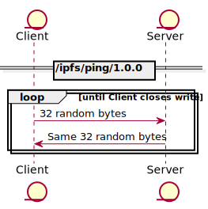

# Ping <!-- omit in toc -->

| Lifecycle Stage | Maturity                 | Status | Latest Revision |
| --------------- | ------------------------ | ------ | --------------- |
| 3A              | Recommendation | Active | r0, 2022-11-04  |

Authors: [@marcopolo]

Interest Group: [@marcopolo], [@mxinden], [@marten-seemann]

[@marcopolo]: https://github.com/mxinden
[@mxinden]: https://github.com/mxinden
[@marten-seemann]: https://github.com/marten-seemann

## Table of Contents <!-- omit in toc -->
- [Protocol](#protocol)
- [Diagram](#diagram)

## Protocol

The ping protocol is a simple liveness check that peers can use to test
the connectivity and performance between two peers. The libp2p ping protocol
is different from the ping command line utility
([ICMP ping](https://en.wikipedia.org/wiki/Internet_Control_Message_Protocol)),
as it requires an already established libp2p connection.

The dialing peer sends a 32-byte payload of random binary data on an open
stream. The listening peer echoes the same 32-byte payload back to the dialing
peer. The dialing peer then measures the RTT from when it wrote the bytes to when
it received them.

The dialing peer MAY repeat the process by sending another payload with random
bytes on the same stream, where the listening peer SHOULD loop and echo the
next payload. The dialing peer SHOULD close the write operation of the stream
after sending the last payload, and the listening peer SHOULD finish writing
the echoed payload and then exit the loop and close the stream.

The dialing peer MUST NOT keep more than one outbound stream for the ping
protocol per peer. The listening peer SHOULD accept at most two streams per
peer since cross-stream behavior is non-linear and stream writes occur
asynchronously. The listening peer may perceive the dialing peer closing and
opening the wrong streams (for instance, closing stream B and opening stream A
even though the dialing peer is opening stream B and closing stream A).

The protocol ID is `/ipfs/ping/1.0.0`.

## Diagram



<details>
  <summary>Instructions to reproduce diagram</summary>

From the root, run:  `plantuml -tsvg ping/ping.md`

```
@startuml
skinparam backgroundColor white

entity Client
entity Server

== /ipfs/ping/1.0.0 ==
loop until Client closes write
    Client -> Server: 32 random bytes
    Client <- Server: Same 32 random bytes
end
@enduml
```

</details>
