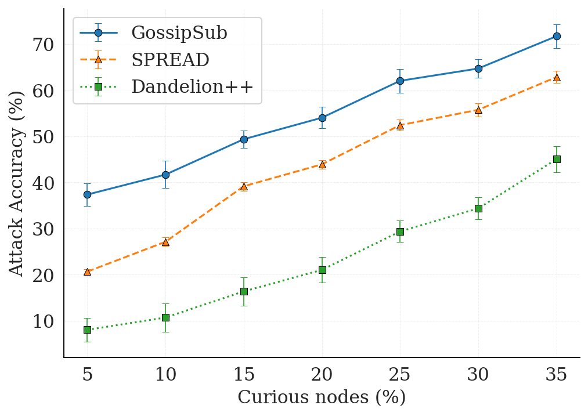
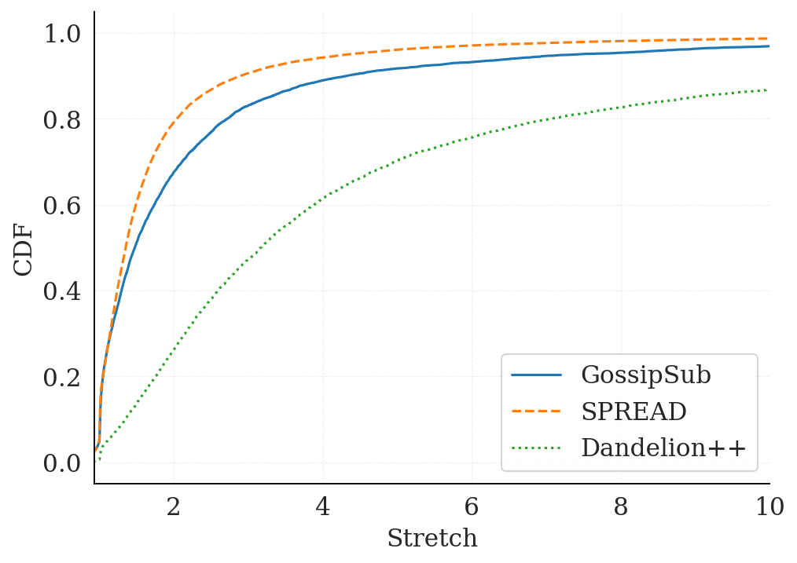
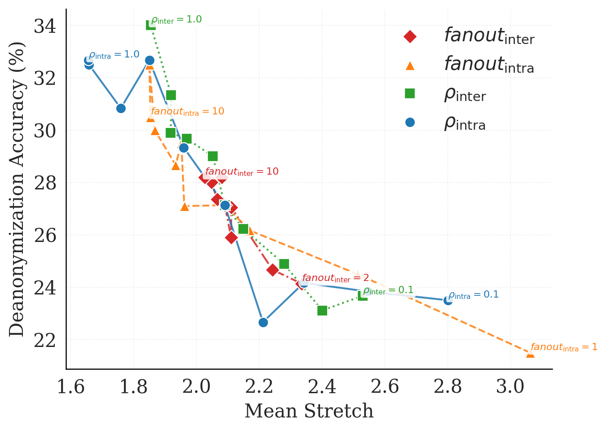

# SPREAD: Extending GossipSub with Efficient Anonymous Dissemination

| Lifecycle Stage | Maturity      | Status | Latest Revision |
| --------------- | ------------- | ------ | --------------- |
| 1A              | Working Draft | Active | r0, 2026-02-13  |

Authors: Diogo Cardoso, Matheus Franco, Rodrigo Rodrigues

## Overview

This document specifies SPREAD (Secure Peer-to-Peer Relay for Efficient Anonymous Dissemination), an
extension to the GossipSub protocol. SPREAD raises the cost of sender deanonymization while
improving dissemination efficiency in geo-distributed deployments. Both properties are relevant to
systems such as Ethereum, where targeted attacks may prevent a node from meeting time-bound duties
(e.g., fulfilling a duty within its assigned slot), and where low-latency delivery is required by
protocols layered on top of the gossip substrate. SPREAD does not provide an absolute guarantee of
source indistinguishability: sender anonymity is a quantitative property dependent on the
adversary's observation capabilities, and the goal is therefore to raise the bar against
deanonymization rather than to prevent it entirely.

SPREAD consists of two mechanisms:

1. a local random walk, which obscures the message origin prior to broad propagation; and
2. geographically directed propagation, which prefers nearby peers as relay hops in order to avoid
costly long-distance transmissions during global dissemination.

SPREAD is implemented as a protocol extension on top of the go-libp2p-pubsub library. The remainder
of this document details SPREAD's motivation, rationale, and protocol design.

## Motivation

Despite the general understanding that gossip protocols can aid in protecting the anonymity of the
original sender of any given message, GossipSub was not designed for and is not able to provide such
guarantees. In particular, a simple attack on the GossipSub layer is possible by observing message
timing at a small set of listener nodes, enabling a centralized coordinator to correlate timings and
infer the true source of gossip messages. This class of passive, timing-based attack was first
demonstrated on Bitcoin, where transactions were linked to the IP addresses that originated them
from a small number of supernodes ([Biryukov et al.](https://doi.org/10.1145/2660267.2660379),
[Fanti and
Viswanath](https://proceedings.neurips.cc/paper_files/paper/2017/file/6c3cf77d52820cd0fe646d38bc2145ca-Paper.pdf)),
and it was later shown to map Ethereum validators to their peer IDs and IP addresses by monitoring
attestation propagation over a few epochs (Sharma et al.; [Heimbach et
al.](https://www.usenix.org/conference/usenixsecurity25/presentation/heimbach);
[Rhea](https://ethresear.ch/t/packetology-validator-privacy/7547)). This is possible despite
GossipSub’s use of randomized forwarding to obscure message paths because a validator’s immediate
peers (i.e., the validator's direct peers in the gossip overlay) consistently receive and propagate
its messages noticeably earlier than others. As such, by deploying a few tens of listener nodes it
becomes highly likely that, after a few epochs, one of the listener nodes will become a direct peer
(and remain so for several subsequent epochs). Therefore, by keeping track of the first listener
node to hear a message over multiple consensus epochs (and which network address that message came
from), the coordinator is eventually able to reliably map validators to their network identities
with high confidence. Once identified, validators can be selectively targeted (e.g., through
denial-of-service), leading to slashing due to missed duties or economic attacks. Crucially, this
deanonymization does not rely on any privileged access and can be mounted only by listening to
traffic at a small number of well-behaved (honest but curious) observers.

This vulnerability stems from a fundamental tension in the design of gossip protocols: increasing
fanout, and more generally dissemination speed, reduces sender anonymity, whereas limiting exposure
through low fanout improves privacy at the cost of propagation delay. GossipSub occupies an
unfavorable point in this tradeoff: it leaks enough structural information to enable
deanonymization, yet disseminates inefficiently, since its latency-oblivious forwarding paths
amplify both delay and overhead.

Prior work has proposed defenses against this class of attack, most notably
[Dandelion](https://doi.org/10.1145/3084459) and [Dandelion++](https://doi.org/10.1145/3224424),
which achieve formally analyzed sender-anonymity guarantees by prepending a random-walk obfuscation
phase to dissemination. These guarantees, however, carry a latency cost that has prevented adoption
in latency-sensitive settings: the Ethereum community concluded that, "because of latency
constraints [...] this proposal [Dandelion++] is infeasible for the Ethereum consensus layer (at
least not for any strong anonymity guarantees)" ([EthResearch
discussion](https://ethresear.ch/t/ethereum-consensus-layer-validator-anonymity-using-dandelion-and-rln-conclusion/12698)).
This tension tends to intensify with the planned reduction of Ethereum's slot time from 12 to 6
seconds ([EIP-7782](https://eips.ethereum.org/EIPS/eip-7782)), imposing even stricter timing
requirements on the gossip layer. Thus, deployments must provide the required performance and
sender-anonymity defenses simultaneously.

SPREAD is designed to address this compound challenge by separating the random-walk hops, which
provide anonymity and are kept local, from the wide-area hops, which use nearby nodes as stepping
stones to avoid costly long-distance paths. The following sections detail this design.


## Terms and definitions

- **Bernoulli Trial**: A random experiment with exactly two outcomes (success/failure), where success occurs with a fixed probability `p`.

- **Cluster**: A group of nearby nodes, i.e., nodes that are close to each other in the virtual coordinate space and therefore communicate with low latency.

- **Curious Nodes (Honest-but-Curious Observers)**:  Nodes that follow the protocol correctly but attempt to infer additional information (e.g., the originator of a given message) from observed traffic
patterns.

- **Deanonymization Accuracy**: The fraction of times an adversary correctly infers the original sender of a message, based on observations available to attacker-controlled nodes.

- **Fanout**: The number of peers to which a node forwards a message during a dissemination step.

- **Gossip Protocol**: A distributed communication protocol in which nodes repeatedly forward information to a subset of neighboring peers, resulting in probabilistic, eventual delivery to all nodes.

- **Random Walk**: A forwarding strategy in which each node forwards a message to a single randomly selected peer.

- **Cobra Walk (Coalescing-Branching Random Walk)**: A variant of the random walk in which each node forwards a message to a number of random neighbors given by a branching factor, allowing the walk to occasionally branch out instead of always forwarding to a single peer.

- **Stretch**: A performance metric defined as the ratio between the actual end-to-end delivery latency and the direct (usually optimal) communication latency between sender and receiver.

- **Virtual Coordinates**: Synthetic coordinates assigned to nodes in a geometric space such that distances between coordinates approximate pairwise network latency, allowing latency estimation without direct measurement.

- **Voronoi Diagram (Dirichlet Tessellation)**: A partition of a space into regions according to a set of reference points (centroids), where each region contains the portion of the space that is closer to its centroid than to any other.

## Design rationale

Formal work by [Guerraoui et al.](https://arxiv.org/abs/2308.02477) showed that anonymity-preserving
gossip requires a strong random walk component, in which nodes often forward a message to a single
overlay neighbor, so that the source remains difficult to identify. The [Dandelion family of
protocols](https://arxiv.org/abs/1805.11060) applies this technique by starting with a random-walk
phase and probabilistically switching to high-fanout dissemination.

The random walk, however, is where the latency cost concentrates: each hop is chosen without regard
to topology, so a single unlucky step across a slow or distant path is enough to degrade end-to-end
stretch, a penalty that is further multiplied when systems such as Ethereum layer multi-step
protocols on top of the gossip substrate. Switching to the high-fanout phase earlier does not help:
it remains exposed to one long initial hop, and it directly weakens the intended anonymity
guarantees.

SPREAD navigates this tradeoff by exploiting the fact that nodes naturally cluster in some regions
(e.g., the US coasts, Europe, Asia). Since latency within such a cluster is low, random walks can be
confined to it, providing anonymity at little performance cost, while occasional inter-cluster hops
handle global dissemination.

Inter-cluster hops pose a second challenge: chosen carelessly, they are just as penalizing, e.g.,
routing a message from Europe to the US East Coast via an overlay hop through Asia. Since anonymity
is already provided by the intra-cluster walks, wide-area dissemination can be optimized purely for
efficiency. SPREAD therefore directs inter-cluster hops toward adjacent clusters, using them as
stepping stones to reach more distant ones. Ideally, with a global view, each cluster would be
represented by its center, the space would be divided into regions according to which center is
closest (a Voronoi diagram, as shown in Figure 1), and messages would cross cluster boundaries only
between neighboring regions.


*Figure 1: Geographic coordinates of a dataset of Internet hosts, augmented with clustering
information showing Voronoi cells. An idealized wide-area gossip step would occur only between
adjacent cells, but this would require a globally coordinated view of the cell division.*

SPREAD, however, is fully decentralized: no single node holds a global view of the clusters or their
connections. Instead, each node approximates the idealized routing locally using virtual
coordinates, a scheme that securely assigns each node Euclidean coordinates whose distances estimate
pairwise latency [Vivaldi, Newton]. With these coordinates, a node defines its cluster as the
closest t% of its overlay neighbors, and classifies each remaining (non-cluster) neighbor by whether
a closer non-cluster neighbor lies in roughly the same direction, i.e., within a configurable
angular interval of its bearing in the coordinate space. Neighbors with such a closer, aligned
alternative are occluded: the closer node can serve as a stepping stone, so they are excluded from
forwarding (occluded_remote). The rest are eligible for inter-cluster hops (unobstructed_remote).


## Protocol specification

SPREAD comprises two components running in parallel: a maintenance algorithm that manages a node's
overlay peers (neighbors) and their secure virtual coordinates, and the dissemination protocol that
publishes and propagates gossip messages. Using the criteria described above, the maintenance
algorithm partitions the neighbors of node i into three subsets: cluster_i, occluded_remote_i, and
unobstructed_remote_i.

The key words MUST, MUST NOT, SHOULD, SHOULD NOT, and MAY are to be interpreted as described in [RFC
2119](https://www.rfc-editor.org/rfc/rfc2119).

### Dissemination

Given this overlay state, the dissemination protocol combines intra-cluster random walks, which
provide anonymity, with inter-cluster forwarding through unobstructed remote neighbors, which
provides efficient global dissemination. Upon receiving or publishing a message, a node decides
between these two behaviors by biased coin flips, with biases set by system parameters. The
pseudocode below specifies how a message is broadcast once the overlay state is established.

```
1: # constants:
2:  ρintra   # Branching probability (intra-cluster)
3:  ρinter   # Inter-cluster dissemination probability
4:  fanoutintra   # Number of intra-cluster peers when branching
5:  fanoutinter   # Number of peers for inter-cluster dissemination

6: # state variables:
7: neighbors_i # Set of overlay neighbors, partitioned into:
8: cluster_i       # Subset of closeby neighbors in Pi’s cluster
9: unobstructed_remote_i  # Subset of remote neighbors that are not efficiently reachable via another neighbor
10: occluded_remote_i      # Subset of remote neighbors that may be reachable via another neighbor

11: upon receiving or publishing message m do
12:  INTRACLUSTERSPREAD(m)
13:  INTERCLUSTERSPREAD(m)

14: procedure INTRACLUSTERSPREAD(m)
15:  if Bernoulli(ρintra) = 0 then
16:      send m to 1 peer in cluster_i selected uniformly at random
17:  else
18:       send m to fanoutintra peers in cluster_i selected uniformly at random

19: procedure INTERCLUSTERSPREAD(m)
20:  if Bernoulli(ρinter) = 1 then
21:      send m to fanoutinter peers in unobstructed_remote_i selected uniformly at random
```

Each protocol iteration performs two steps: intra-cluster and inter-cluster propagation (lines
12–13). Intra-cluster propagation follows the cobra walk (coalescing-branching random walk)
algorithm ([Dutta et al.](https://doi.org/10.1145/2817830)): a random walk that branches according
to a local Bernoulli trial with parameter ρintra (line 15). On failure, the node forwards the
message to a single peer selected uniformly at random from cluster_i, continuing the random walk
(line 16); on success, it forwards to fanoutintra such peers, accelerating dissemination within the
cluster (line 18). Inter-cluster propagation drives global dissemination and is governed by a second
Bernoulli trial with parameter ρinter (line 20). On failure, the node keeps all communication within
its cluster; on success, it forwards the message to fanoutinter peers selected uniformly at random
from unobstructed_remote_i (line 21).

A node may propagate the same message multiple times, and the algorithm deliberately includes no
deduplication: [Bellet et
al.](https://drops.dagstuhl.de/entities/document/10.4230/LIPIcs.DISC.2020.8) have shown that when
nodes propagate a message only once, timestamp tracking makes the source easier to identify. In
practice, however, termination is required to avoid congestion in systems that continuously generate
messages. A simple mechanism suffices: a node propagates a given message (which may arrive
repeatedly via different neighbors) a fixed number of times and then stops. This parameter
effectively controls the reliability of the protocol, and small values suffice for realistic network
sizes ([Kermarrec et al.](https://doi.org/10.1109/TPDS.2003.1189583)). Additional reliability
mechanisms can complement this, and GossipSub already provides them: heartbeat messages advertising
seen messages, and pull requests to fetch missing ones.

This message pull mechanism is also valuable for robustness in two additional scenarios. First,
under churn, a succession of node failures or departures can prevent the direct propagation from
being effective, and the heartbeat-and-pull mechanism lets nodes recover the messages they missed.
Second, it helps defend against Byzantine nodes: while simple cryptography prevents such nodes from
tampering with message contents, they can still deliberately delay or refuse to forward messages,
endangering progress, which the heartbeats and pulls counter.

### Extension negotiation

We define SPREAD as an [extension](../gossipsub-v1.3.md) of GossipSub rather than as a separate
protocol, which makes it an optional feature that a node may choose to support, without requiring
agreement from the rest of the network. Currently, its `ControlExtensions` and `RPC` field numbers
lie in the experimental range, and implementations MUST use the `/meshsub/1.3.0` protocol ID or a
later one.

A node that supports SPREAD MUST set `ControlExtensions.spread = true` in the Extensions control
message it sends as part of the first RPC on the stream, as specified by GossipSub v1.3. As with
every GossipSub extension, this is an advertisement rather than a negotiation, in the sense that
each peer only describes itself, and then each peer decides its own behavior by combining the two
advertisements.

A node MUST NOT apply SPREAD forwarding toward a peer that has not advertised `spread`, and MUST NOT
include the `SpreadExtension` message in an RPC sent to such a peer. Peers that have not advertised
the extension are therefore served by standard GossipSub forwarding, and a node whose peers all lack
it behaves exactly as an unmodified GossipSub node. Conversely, a node that has advertised `spread`
MUST still accept and forward messages that carry no SPREAD marker, using standard GossipSub rules,
since SPREAD selection applies per message and not per connection.

### Marking messages

To keep its footprint minimal, SPREAD does not introduce a new message type. A SPREAD message
travels in the standard GossipSub envelope, and the RPC that carries it names which of its entries
the extension applies to.

```protobuf
message ControlExtensions {
  // ...
  optional bool spread = 6492435;
}

message RPC {
  repeated Message publish = 2;
  // ...
  optional SpreadExtension spread = 6492435;
}

message SpreadExtension {
  // Zero-based indices into RPC.publish identifying the messages that are
  // being disseminated via SPREAD.
  repeated uint32 publishIndices = 1;
}
```

These fields are registered in [`extensions.proto`](../extensions/extensions.proto), which
implementations MUST use. The `publishIndices` field identifies, per RPC, which of the `publish`
entries are SPREAD messages, so that the marker is carried per message rather than per RPC, which
matters because an RPC MAY batch SPREAD and non-SPREAD messages together.

- Indices are zero-based and refer to `RPC.publish` of the same RPC. A receiver MUST ignore any index that is out of range, as well as duplicate indices.
- An absent `SpreadExtension`, or one with an empty `publishIndices`, means that no message in the RPC is a SPREAD message.
- A receiver that supports SPREAD MUST apply the propagation rules of this document to each marked
  message, and when it relays such a message it MUST mark it again in the RPCs it sends to
  SPREAD-capable peers, so that SPREAD behavior is preserved along the path.
- A receiver that does not support SPREAD ignores the field, which is the default behavior of
  protobuf parsers, and forwards the message using standard GossipSub.

This last behavior is what enables mixed deployments and a smooth, incremental adoption path, since
a message benefits from SPREAD's dissemination until it reaches a node that does not support the
extension, which means that partial anonymity and performance gains are already possible before
network-wide adoption.

### Coordinate maintenance

To build the clusters used for propagation, each SPREAD-capable node maintains virtual coordinates
for itself and for the other SPREAD-capable peers it knows about. These coordinates are produced by
a Vivaldi process fed with round-trip-time measurements from periodic probes, which is the only
addition SPREAD makes to the communication profile of a node. To prevent malicious peers from
distorting the coordinate space, each coordinate update MUST be validated by Newton-based checks and
rejected whenever it would break a physical invariant.

## Security considerations

SPREAD hides which node originated a message at the network layer, but it cannot hide an originator
that the message itself names. Under GossipSub's signing policies, a published message carries the
`from`, `seqno`, and `signature` fields, which identify the publishing peer inside the payload and
therefore render the random walk irrelevant, since an adversary can simply read the source off any
copy of the message it receives. As such, deployments that adopt SPREAD for its anonymity properties
MUST configure the corresponding topics with `StrictNoSign`, where these fields are absent, as is
already the case in Ethereum's consensus layer. A deployment interested only in SPREAD's efficiency
gains, however, can use it under any signing policy, since topology-aware dissemination does not
depend on the sender being hidden. In that case the anonymity results reported below simply do not
apply, and an implementation SHOULD make that explicit rather than leave the operator to assume
otherwise.

## Evaluation

We evaluate SPREAD along two complementary dimensions: its resistance to deanonymization attacks and
its efficiency in disseminating messages across wide-area networks. We compare it against GossipSub,
which is deployed in Ethereum, and Dandelion++, a research proposal designed to improve anonymity.
Because SPREAD is implemented as an extension of `go-libp2p-pubsub`, we are able to evaluate the
actual production code: we run it over [simnet](https://github.com/marcopolo/simnet), a packet-level
simulator that connects the real implementation through virtual links with configurable latency and
bandwidth. To reflect a realistic deployment, we draw network topologies from a [global Internet
dataset](https://wonderproxy.com/blog/a-day-in-the-life-of-the-internet/) with real round-trip-time
measurements between geographically distributed nodes, sampling several topologies and aggregating
the results. Dandelion++ is implemented on the same stack, so that all three protocols share the
same implementation and differ only in their dissemination strategy.

For a fair comparison, we configure the three protocols so that, in expectation, each node forwards
a message to the same number of peers, i.e., they share the same per-node bandwidth budget. We use
GossipSub's default mesh size of 6 as the target expected fanout, and tune SPREAD's four parameters
and Dandelion++'s parameters to match it. We measure anonymity through a deanonymization accuracy
metric under a first-timestamp estimator: for a given fraction of curious nodes, we sample many
attacker placements and, for each message, guess its sender as the node that delivered it to a
curious node with the earliest timestamp; the accuracy is the fraction of correct guesses. We
measure performance through both the absolute delivery latency and the stretch metric, defined as
the ratio between the actual end-to-end delivery time of a message and the direct communication
latency between its sender and receiver.

### Anonymity

All protocols become more vulnerable as the adversary controls a larger share of the network, but to
markedly different degrees. GossipSub is the most exposed: with only 5% of curious nodes, the
attacker already succeeds in over 35% of cases, rising to 54% at 20%. Dandelion++ achieves the
strongest anonymity, staying below 10% at 5% curious nodes and around 20% even at 20%, owing to its
random-walk obfuscation phase. SPREAD sits between the two: at 5% curious nodes its accuracy is in
the low-20% range, and at 20% it reaches roughly 45%. Therefore, it reduces the adversary's success
rate relative to GossipSub, while trading a modest anonymity gap to Dandelion++ in exchange for
significantly better dissemination efficiency.



*Figure 2: Deanonymization (attack) accuracy as a function of the percentage of curious nodes, for
GossipSub, Dandelion++, and SPREAD.*

### Performance

SPREAD achieves the most efficient dissemination of the three protocols. At a stretch threshold of
3, over 90% of deliveries complete under SPREAD, compared to about 83% for GossipSub and only 50%
for Dandelion++; the gap persists into the tail, where SPREAD and GossipSub approach full coverage
well before Dandelion++. Overall, SPREAD lowers the mean stretch by about 23% relative to GossipSub
and about 67% relative to Dandelion++, and it shrinks the heavy tail even more markedly, reducing
the 99th-percentile stretch by roughly 39% and 74%, respectively. The same ordering holds for
absolute latency: half of SPREAD's deliveries complete in under 100 ms, against 40% for GossipSub
and 10% for Dandelion++. This tail behavior is particularly important when multi-step protocols are
layered on top of gossip, as in Ethereum, since each additional step multiplies the single-hop
latency penalty.



*Figure 3: Cumulative distribution of stretch across all sender-receiver pairs, for the three
protocols.*


*Figure 4: Cumulative distribution of absolute delivery latency across all sender-receiver pairs.*

### Tuning

Finally, we study how SPREAD's four parameters trade anonymity against performance. Across all of
them, increasing the fanout or the branching probability lowers stretch but simultaneously raises
attack accuracy, and vice versa, which confirms that SPREAD can be tuned along a continuum: lower
values maximize privacy, while higher values shift the balance toward performance. The intra-cluster
parameters dominate the stretch profile, whereas the inter-cluster probability acts mostly as an
anonymity knob with diminishing returns on performance. The configuration used in the comparisons
above deliberately targets a balanced point in this spectrum, rather than either extreme.



*Figure 5: Mean stretch versus deanonymization accuracy for single-parameter variations of SPREAD,
at 10% curious nodes. Each line connects successive values of one parameter.*

Overall, these results show that both dimensions of Ethereum's current design can be improved at
once: switching to SPREAD lowers deanonymization accuracy relative to GossipSub while also achieving
lower mean and tail stretch. Compared to Dandelion++, SPREAD gives up some anonymity, but it avoids
the latency overhead that makes strong-anonymity proposals impractical for latency-sensitive
settings such as Ethereum's consensus layer.
