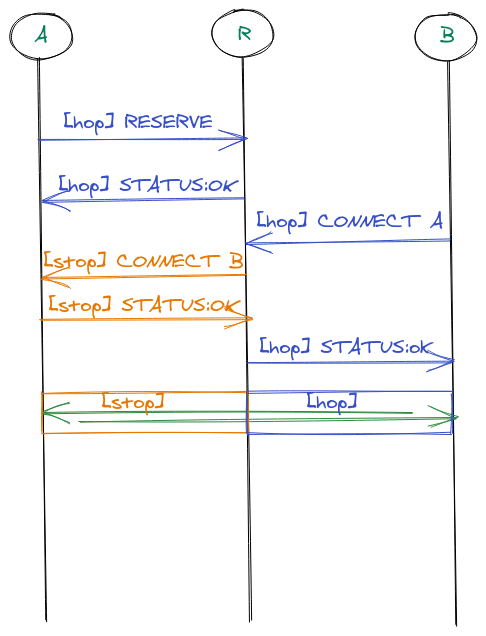

# Circuit Relay v2

This is the version 2 of the libp2p Circuit Relay protocol.

| Lifecycle Stage | Maturity       | Status | Latest Revision |
|-----------------|----------------|--------|-----------------|
| 1A              | DRAFT          | Active | r0, 2021-05-05  |

Authors: [@vyzo]

Interest Group: [@mxinden], [@stebalien], [@raulk]

[@vyzo]: https://github.com/vyzo
[@mxinden]: https://github.com/mxinden
[@stebalien]: https://github.com/stebalien
[@raulk]: https://github.com/raulk

See the [lifecycle document][lifecycle-spec] for context about maturity level
and spec status.

[lifecycle-spec]: https://github.com/libp2p/specs/blob/master/00-framework-01-spec-lifecycle.md

## Table of Contents

- [Introduction](#introduction)
  - [Rationale](#rationale)
- [The Protocol](#the-protocol)
  - [Interaction](#interaction)
  - [Hop Protocol](#hop-protocol)
  - [Stop Protocol](#stop-protocol)
  - [Reservation Vouchers](#reservation-vouchers)
- [Protobuf](#protobuf)

## Introduction

This is the specification of v2 of the p2p-circuit relay protocol.

Compared to the first version of the protocol, there are some significant departures:
- The protocol has been split into two subprotocols, `hop` and `stop`
  - The `hop` protocol governs the behaviour of relays; it is used for
    reserving resources in the relay and opening a switched connection
    to a peer through the relay.
  - The `stop` protocol governs the termination of circuit switched
    connections.
- The concept of resource reservation has been introduced, whereby
  peers wishing to use a relay explicitly reserve resources and obtain
  _reservation vouchers_ which can be distributed to their peers for
  routing purposes.
- The concept of limited relaying has been introduced, whereby relays
  provide switched connectivity with a limited duration and data cap.

### Rationale

The evolution of the protocol towards v2 has been influenced by our
experience in operating open relays in the wild.  The original
protocol, while very flexible, has some limitations when it comes to
the practicalities of relaying connections.

The main problem is that v1 has no mechanism to reserve resources in the
relay, which leads to continuoues oversubscription of relays and the
necessity of (often ineffective) heuristics for balancing resources.
In practice, running a relay proved to be an expensive proposition
requiring dedicated hosts with significant hardware and bandwidth
costs.  In addition, there is ongoing work in Hole Punching
coordination for direct connection upgrade through relays, which
doesn't require an unlimited relay connection.

In order to address the situation and seamlessly support pervasive
hole punching, we have introduced limited relays and slot
reservations.  This allows relays to effectively manage their
resources and provide service at a small scale, thus enabling the
deployment of an army of relays for extreme horizontal scaling without
excessive bandwidth costs and dedicated hosts.

Furthermore, the original decision to conflate circuit initiation and
termination in the same protocol has made it very hard to provide
relay service on demand, decoupled with whether _client_ functionality
is supported by the host.

In order to address this problem, we have splt the protocol into the
`hop` and `stop` subprotocols. This allows us to always enable the
client-side functionality in a host, while providing the option to
later mount the relay service in public hosts, _after_ the
reachability of the host has been determined through [AutoNAT].

[AutoNAT]: https://github.com/libp2p/specs/issues/180

## The Protocol

### Interaction

The following diagram illustrates the interaction between three peers,
_A_, _B_, and _R_, in the course of establishing a relayed connection.
Peer _A_ is a private peer, which is not publicly reachable; it
utilizes the services of peer _R_ as the relay.  Peer _B_ is another
peer who wishes to connect to peer _A_ through _R_.



The first part of the interaction is _A_'s reservation of a relay slot
in _R_.  This is accomplished by opening a connection to _R_ and
sending a `RESERVE` message in the `hop` protocol; if the reservation
is successful, the relay responds with a `STATUS:OK` message and
provides _A_ with a reservation voucher. _A_ keeps the connection to _R_ alive for the duration of the reservation, refreshing the reservation as needed.

The second part of the interaction is the establishment of a circuit
switch connection from _B_ to _A_ through _R_.  It is assumed that _B_
has obtained a circuit multiaddr for _A_ of the form
`/p2p/QmR/p2p-circuit/p2p/QmA` out of band using some peer discovery
service (eg. the DHT or a rendezvous point).

In order to connect to _A_, _B_ then conncts to _R_, opens a `hop`
protocol stream and sends a `CONNECT` message to the relay.  The relay
verifies that it has a reservation and connection for _A_ and opens a
`stop` protocol stream to _A_, sending a `CONNECT` message.

Peer _A_ then responds to the relay with a `STATUS:OK` message, which
responds to _B_ with a `STATUS:OK` message in the open `hop` stream
and then proceeds to bridge the two streams into a relayed connection.
The relayed connection flows in the `hop` stream between the
connection initiator and the relay and in the `stop` stream between
the relay and the connection termination point.

### Hop Protocol

The Hop protocol governs interaction between clients and the relay;
it uses the protocol ID `/libp2p/circuit/relay/0.2.0/hop`.

There are two parts of the protocol:
- reservation, by peers that wish to receive relay service
- connection initiation, by peers that wish to connect to a peer through the relay.

#### Reservation

In order to make a reservation, a peer opens a connection to the relay and sends a `HopMessage` with
`type = RESERVE`:

```
HopMessage {
  type = RESERVE
}
```

The relay responds with a `HopMessage` of `type = STATUS`, indicating whether the reservation has
been accepted.

If the reservation is accepted, then the message has the following form:
```
HopMessage {
  type = STATUS
  status = OK
  reservation = Reservation {...}
  limit = Limit {...}
}
```

The `reservation` field provides information about the reservation itself; the struct has the following fields:
```
Reservation {
   expire = ...
   addrs = [...]
   voucher = ...
}
```

- the `expire` field contains the expiration time as a UTC UNIX time. The reservation becomes invalid after this time and it's the responsibility of the client to refresh.
- the `addrs` fields contains the all public relay addrs, including the peer ID but not the
  trailing `p2p-circuit` part; the client can use this list to constrct its
  own `p2p-circuit` relay addrs for advertising by encapsulating
 `p2p-circuit/p2p/QmPeer` where `QmPeer` is its peer ID.
- the `voucher` is the binary representation of the reservation voucher -- see [Reservation Vouchers](#reservation-vouchers) for details.

The `limit` field, if present, provides information about the limits applied by the relay in relayed connection. When omitted, it indicates that the relay does not apply any limits.
The struct has the following fields:
```
Limit {
  duration = ...
  data = ...
```
- the `duration` field indicates the maximum duration of a relayed connection in seconds; if 0, there is no limit applied.
- the `data` field indicates the maximum number of bytes allowed to be transmitted in each direction; if 0 there is no limit applied.

Note that the reservation remains valid until its expiration, as long
as there is an active connection from the peer to the relay. If the
peer disconnects, the reservation is no longer valid.

If the reservation is rejected, the relay responds with a `HopMessage` of the form
```
Reservation {
  type = STATUS
  status = ...
}
```
where the `status` field has a value other than `OK`. Common rejection status codes are:
- `PERMISSION_DENIED` if the reservation is rejected because of peer filtering using ACLs.
- `RESERVATION_REFUSED` if the reservation is rejected for some other reason, eg because there are too
  many reservations.

#### Connection Initiation

In order to initiate a connection to a peer through a relay, the initiator opens a connection and sends a `HopMessage` of `type = CONNECT`:
```
HopMessage {
  type = CONNECT
  peer = Peer {...}
}
```

The `peer` field contains the peer `ID` of the target peer and optionally the address of that peer for the case of active relay:
```
Peer {
  id = ...
  addrs = [...]
```

Note that active relay functionality is considered deprecated for security reasons, at least in public relays.
However, the protocol reserves the slot to support the functionality for the rare cases where it is actually desirable to use active relay functionality in a controlled environment.

If the relay has a reservation (and thus an active connection) from the peer, then it opens the second hop of the connection using the `stop` protocol; the details are not relevant for the `hop` protocol and the only thing that matters is whether it succeeds in opening the relay connection or not.
If the relayed connection is successfully established, then the relay responds with `HopMessage` with `type = STATUS` and `status = OK`:
```
HopMessage {
  type = STATUS
  sgtatus = OK
  limit = Limit {...}
}
```
at this point the original `hop` stream becomes the relayed connection.
The `limit` field, if present, communicates to the initiator the
limits applied to the relayed connection with the semantics described
[above](#reservation).

If the relayed connection cannot be established, then the relay responds with a `HopMessage` of `type = STATUS` and the `status` field having a value other than `OK`.
Common failure status codes are:
- `PERMISSION_DENIED` if the connection is rejected because of peer filtering using ACLs.
- `NO_RESERVATION` if there is no active reservation for the target peer
- `RESOURCE_LIMIT_EXCEEDED` if there are two many relayed connections from the initiator or to the target peer.
- `CONNECTION_FAILED` if the relay failed to terminate the connection to the target peer.


### Stop Protocol

The Stop protocol governs connection termination between the relay and the target peer;
it uses the protocol ID `/libp2p/circuit/relay/0.2.0/stop`.

In order to terminate a relayed connection, the relay opens a stream
using an existing connection to the target peer. If there is no
existing connection, an active relay may attempt to open one using the
initiator supplied address, but as discussed in the previous section
this functionality is generally deprecated.

The relay sends a `StopMessage` with `type = CONNECT` and the following form:
```
StopMessage {
  type = CONNECT
  peer = Peer { ID = ...}
  limit = Limit { ...}
}
```
- the `peer` field contains a `Peer` struct with the peer `ID` of the connection initiator.
- the `limit` field, if present, conveys the limits applied to the relayed connection with the semantics described [above](#reservation).

If the target peer accepts the connection it responds to the relay with a `StopMessage` of `type = STATUS` and `status = OK`:
```
StopMessage {
  type = STATUS
  status = OK
}
```

If the target fails to terminate the connection for some reason, then it responds to the relay with a `StopMessage` of `type = STATUS` and the `status` code set to something other than `OK`.
Common failure status codes are:
- `CONNECTION_FAILED` if the target internally failed to create the relayed connection for some reason.

### Reservation Vouchers

Successful relay slot reservations come with _Reservation Vouchers_.
These are cryptographic certificates signed by the relay that testify that it is willing to provide
service to the reserving peer.
The intention is to eventually require the use of reservation vouchers for dialing relay addresses,
but this is not currently enforced so the vouchers are only advisory.

The voucher itself is a [Signed Envelope](../RFC/0002-signed-envelopes.md).
The payload of the envelope has the following form, in canonicalized protobuf format:
```
message Voucher {
  required bytes relay = 1;
  required bytes peer = 2;
  required uint64 expiration = 3;
}
```
- the `relay` field is the peer ID of the relay.
- the `peer` field is the peer ID of the reserving peer.
- the `expiration` field is the UNIX UTC expiration time for the reservation.

The wire representation is cononicalized, where elements of the message are written in field id order.


## Protobuf

```
message HopMessage {
  enum Type {
    RESERVE = 0;
    CONNECT = 1;
    STATUS = 2;
  }

  required Type type = 1;

  optional Peer peer = 2;
  optional Reservation reservation = 3;
  optional Limit limit = 4;

  optional Status status = 5;
}

message StopMessage {
  enum Type {
    CONNECT = 0;
    STATUS = 1;
  }

  required Type type = 1;

  optional Peer peer = 2;
  optional Limit limit = 3;

  optional Status status = 4;
}

message Peer {
  required bytes id = 1;
  repeated bytes addrs = 2;
}

message Reservation {
  optional uint64 expire = 1; // Unix expiration time (UTC)
  repeated bytes addrs = 2;   // relay addrs for reserving peer
  optional bytes voucher = 3; // reservation voucher
}

message Limit {
  optional uint32 duration = 1; // seconds
  optional uint64 data = 2;     // bytes
}

enum Status {
  OK                      = 100;
  RESERVATION_REFUSED     = 200;
  RESOURCE_LIMIT_EXCEEDED = 201;
  PERMISSION_DENIED       = 202;
  CONNECTION_FAILED       = 203;
  NO_RESERVATION          = 204;
  MALFORMED_MESSAGE       = 400;
  UNEXPECTED_MESSAGE      = 401;
}
```
