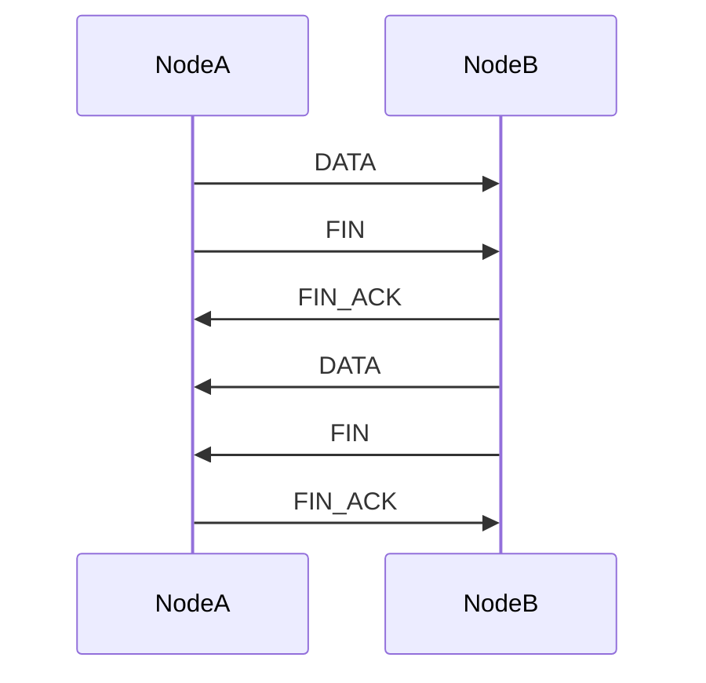

# WebRTC

| Lifecycle Stage | Maturity                 | Status | Latest Revision |
|-----------------|--------------------------|--------|-----------------|
| 2A              | Candidate Recommendation | Active | r1, 2023-04-12  |

Authors: [@mxinden]

Interest Group: [@marten-seemann]

[@marten-seemann]: https://github.com/marten-seemann
[@mxinden]: https://github.com/mxinden/

WebRTC flavors in libp2p:

1. [WebRTC](./webrtc.md)

   libp2p transport protocol enabling two private nodes (e.g. two browsers) to
   establish a direct connection.

2. [WebRTC Direct](./webrtc-direct.md)

   libp2p transport protocol **without the need for trusted TLS certificates.**
   Enable browsers to connect to public server nodes without those server nodes
   providing a TLS certificate within the browser's trustchain. Note that we can
   not do this today with our Websocket transport as the browser requires the
   remote to have a trusted TLS certificate. Nor can we establish a plain TCP or
   QUIC connection from within a browser. We can establish a WebTransport
   connection from the browser (see [WebTransport
   specification](../webtransport)).

## Shared concepts

### Multiplexing

The WebRTC browser APIs do not support half-closing of streams nor resets of the
sending part of streams.
[`RTCDataChannel.close()`](https://developer.mozilla.org/en-US/docs/Web/API/RTCDataChannel/close)
flushes the remaining messages and closes the local write and read side. After
calling `RTCDataChannel.close()` one can no longer read from nor write to the channel. This
lack of functionality is problematic, given that libp2p protocols running on top
of transport protocols, like WebRTC, expect to be able to half-close or reset a
stream. See [Connection Establishment in
libp2p](https://github.com/libp2p/specs/blob/master/connections/README.md#definitions).

To support half-closing and resets of streams, libp2p WebRTC uses message
framing. Messages on a `RTCDataChannel` are embedded into the Protobuf message
below and sent on the `RTCDataChannel` prefixed with the message length in
bytes, encoded as an unsigned variable length integer as defined by the
[multiformats unsigned-varint spec][uvarint-spec].

It is an adaptation from the [QUIC RFC]. When in doubt on the semantics of
these messages, consult the [QUIC RFC].

``` proto
syntax = "proto2";

package webrtc.pb;

message Message {
  enum Flag {
    // The sender will no longer send messages on the stream.
    FIN = 0;
    // The sender will no longer read messages on the stream. Incoming data is
    // being discarded on receipt.
    STOP_SENDING = 1;
    // The sender abruptly terminates the sending part of the stream. The
    // receiver MAY discard any data that it already received on that stream.
    RESET_STREAM = 2;
    // Sending the FIN_ACK flag acknowledges the previous receipt of a message
    // with the FIN flag set. Receiving a FIN_ACK flag gives the recipient
    // confidence that the remote has received all sent messages.
    FIN_ACK = 3;
  }

  optional Flag flag=1;

  optional bytes message = 2;
}
```

Note that in contrast to QUIC (see [QUIC RFC - 3.5 Solicited State
Transitions](https://www.rfc-editor.org/rfc/rfc9000.html#section-3.5)) a libp2p
WebRTC endpoint receiving a `STOP_SENDING` frame SHOULD NOT send a
`RESET_STREAM` frame in reply. The `STOP_SENDING` frame is used for accurate
accounting of the number of bytes sent for connection-level flow control in
QUIC. The libp2p WebRTC message framing is not concerned with flow-control and
thus does not need the `RESET_STREAM` frame to be send in reply to a
`STOP_SENDING` frame.

Encoded messages including their length prefix MUST NOT exceed 16kiB to support
all major browsers. See ["Understanding message size
limits"](https://developer.mozilla.org/en-US/docs/Web/API/WebRTC_API/Using_data_channels#understanding_message_size_limits).
Implementations MAY choose to send smaller messages, e.g. to reduce delays
sending _flagged_ messages.

#### Ordering

Implementations MAY expose an unordered byte stream abstraction to the user by
overriding the default value of `ordered` `true` to `false` when creating a new
data channel via
[`RTCPeerConnection.createDataChannel`](https://www.w3.org/TR/webrtc/#dom-peerconnection-createdatachannel).

#### Head-of-line blocking

WebRTC datachannels and the underlying SCTP is message-oriented and not
stream-oriented (e.g. see
[`RTCDataChannel.send()`](https://developer.mozilla.org/en-US/docs/Web/API/RTCDataChannel/send)
and
[`RTCDataChannel.onmessage()`](https://developer.mozilla.org/en-US/docs/Web/API/RTCDataChannel#example)).
libp2p streams on the other hand are byte oriented. Thus we run into the risk of
head-of-line blocking.

Given that the browser does not give us access to the MTU on a given connection,
we can not make an informed decision on the optimal message size.

We follow the recommendation of QUIC, requiring ["a minimum IP packet size of at
least 1280
bytes"](https://datatracker.ietf.org/doc/html/draft-ietf-quic-transport-29#section-14).
We calculate with an IPv4 minimum header size of 20 bytes and an IPv6 header
size of 40 bytes. We calculate with a UDP header size of 8 bytes. An SCTP packet
common header is 12 bytes long. An SCTP data chunk header size is 16 bytes.

- IPv4: `1280 bytes - 20 bytes - 8 bytes - 12 bytes - 16 bytes = 1224 bytes`
- IPv6: `1280 bytes - 40 bytes - 8 bytes - 12 bytes - 16 bytes = 1204 bytes`

Thus for payloads that would suffer from head-of-line blocking, implementations
SHOULD choose a message size equal or below 1204 bytes. Or, in case the
implementation can differentiate by IP version, equal or below 1224 bytes on
IPv4 and 1224 bytes on IPv6.

Long term we hope to be able to give better recommendations based on
real-world experiments.

#### `RTCDataChannel` negotiation

`RTCDataChannel`s are negotiated in-band by the WebRTC user agent (e.g. Firefox,
Pion, ...). In other words libp2p WebRTC implementations MUST NOT change the
default value `negotiated: false` when creating a standard libp2p stream
of type `RTCDataChannel` via `RTCPeerConnection.createDataChannel`.
Setting `negotiated: true` is reserved only for creating Noise handshake channels
under certain protocol conditions.

The WebRTC user agent (i.e. not the application) decides on the `RTCDataChannel`
ID based on the local node's connection role. For the interested reader see
[RF8832 Protocol
Overview](https://www.rfc-editor.org/rfc/rfc8832.html#section-4). It is
RECOMMENDED that user agents reuse IDs once their `RTCDataChannel` closes. IDs
MAY be reused according to RFC 8831: "Streams are available for reuse after a
reset has been performed", see [RFC 8831 6.7 Closing a Data Channel
](https://datatracker.ietf.org/doc/html/rfc8831#section-6.7). Up to 65535
(`2^16`) concurrent data channels can be opened at any given time.

According to RFC 8832 a `RTCDataChannel` initiator "MAY start sending messages
containing user data without waiting for the reception of the corresponding
DATA_CHANNEL_ACK message", thus using `negotiated: false` does not imply an
additional round trip for each new `RTCDataChannel`.

#### `RTCDataChannel` label

`RTCPeerConnection.createDataChannel()` requires passing a `label` for the
to-be-created `RTCDataChannel`. When calling `createDataChannel` implementations
MUST pass an empty string. When receiving an `RTCDataChannel` via
`RTCPeerConnection.ondatachannel` implementations MUST NOT require `label` to be
an empty string. This allows future versions of this specification to make use
of the `RTCDataChannel` `label` property.

## Closing an `RTCDataChannel`

Some WebRTC implementations do not guarantee that any queued messages will be
sent after a datachannel is closed.  Other implementations maintain separate
outgoing message and transport queues, the status of which may not be visible
to the user. Consequently we must add an additional layer of signaling to ensure
reliable data delivery.

When a node wishes to close a stream for writing, it SHOULD send a message with
the `FIN` flag set, then proceed to wait for a `FIN_ACK` message from the remote
node.

If a `FIN` flag is received the node SHOULD respond with a `FIN_ACK`.

When a `FIN_ACK` and a `FIN` have been received, a node may close the datachannel.

The node MAY close the datachannel without receiving a `FIN_ACK`, for example in
the case of a timeout, but there will be no guarantee that all previously sent
messages have been received.

If a node has previously sent a `STOP_SENDING` flag to the remote node, it MUST
continue to act on any flags present in received messages in order to
successfully process an incoming `FIN_ACK`.

### Example of closing an `RTCDataChannel`

NodeA closes for writing, NodeB delays allowing the channel to close until it also
finishes writing.



After NodeA has received the `FIN` it is free to close the datachannel since it
has previously received a `FIN_ACK`. If NodeB receives the `FIN_ACK` before this
it may close the channel since it previously received a `FIN`.

This way the channel can be closed from either end without data loss.

## Previous, ongoing and related work

- Completed implementations of this specification:
  - <https://github.com/libp2p/rust-libp2p/pull/2622>
  - <https://github.com/libp2p/js-libp2p-webrtc>
- Work in progress implementations of this specification:
  - <https://github.com/libp2p/go-libp2p/pull/1999>
- Past related work:
  - Proof of concept for the server side (native) and the client side (Rust in
    WASM): <https://github.com/wngr/libp2p-webrtc>
  - WebRTC using STUN and TURN: <https://github.com/libp2p/js-libp2p-webrtc-star>

## FAQ

- _Why use Protobuf for WebRTC message framing. Why not use our own,
  potentially smaller encoding schema?_

  The Protobuf framing adds an overhead of 5 bytes. The unsigned-varint prefix
  adds another 2 bytes. On a large message the overhead is negligible (`(5
  bytes + 2 bytes) / (16384 bytes - 7 bytes) = 0.000427246`). On a small
  message, e.g. a multistream-select message with ~40 bytes the overhead is high
  (`(5 bytes + 2 bytes) / 40 bytes = 0.175`) but likely irrelevant.

  Using Protobuf allows us to evolve the protocol in a backwards compatibile way
  going forward. Using Protobuf is consistent with the many other libp2p
  protocols. These benefits outweigh the drawback of additional overhead.

- _Why not use a central TURN servers? Why rely on libp2p's Circuit Relay v2
  instead?_

  As a peer-to-peer networking library, libp2p should rely as little as possible
  on central infrastructure.

[QUIC RFC]: https://www.rfc-editor.org/rfc/rfc9000.html
[uvarint-spec]: https://github.com/multiformats/unsigned-varint
